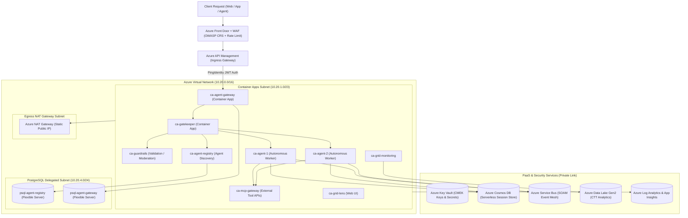

# Digital Agent Platform (DAP) - Microsoft Azure Architecture

## 1. High-Level Architecture Overview

The **Digital Agent Platform (DAP)** is an enterprise-grade, multi-agent AI autonomous execution framework built natively on **Microsoft Azure**. It mirrors the Google Cloud Platform (GCP) implementation 1-to-1, providing high availability, Zero-Trust security, private networking, CMEK data encryption, and event-driven communication.

---

## 2. Multi-Cloud 1-to-1 Service Mapping

| Domain | Google Cloud Platform (GCP) | Microsoft Azure | Purpose in DAP Platform |
| :--- | :--- | :--- | :--- |
| **Compute** | Cloud Run v2 Services | **Azure Container Apps (ACA)** | Serverless microservices hosting 9 multi-agent containers |
| **Edge & WAF** | Cloud Armor Security Policy | **Azure Front Door + WAF** | OWASP CRS 3.2 protection & 500 req/min rate limiting |
| **API Ingress** | Google Cloud API Gateway | **Azure API Management (APIM)** | PingIdentity JWT OAuth2 validation & OpenAPI routing |
| **Relational DB** | Cloud SQL (PostgreSQL) | **Azure PostgreSQL Flexible Server** | Relational state for Agent Registry and Gateway |
| **Session State** | Cloud Firestore Native | **Azure Cosmos DB (Serverless NoSQL)** | Fast session state and conversation history |
| **Messaging** | Cloud Pub/Sub Topics & Subscriptions | **Azure Service Bus Topics & Queues** | Asynchronous SOAM event dispatch with DLQ |
| **Secrets & Keys** | Secret Manager & Cloud KMS | **Azure Key Vault** | RSA CMEK encryption keys & application secrets |
| **Telemetry** | Google BigQuery | **Azure Data Lake Storage Gen2 (ADLS)** | High-throughput CTT telemetry logs & transaction analytics |
| **Observability** | Cloud Logging & Monitoring | **Azure Log Analytics & App Insights** | Distributed OpenTelemetry tracing & centralized logs |
| **CI/CD Security** | Workload Identity Federation (WIF) | **Entra ID Federated Credentials (OIDC)** | Keyless GitHub Actions deployment |

---

## 3. Network Architecture & Traffic Flow

### Ingress Path (North-South Inbound):
1. **Public Edge**: Client requests hit **Azure Front Door** with global Anycast routing and SSL termination.
2. **WAF Enforcement**: Front Door WAF blocks SQL Injection, XSS, RCE, and enforces 500 req/min rate limits.
3. **API Management**: Requests route to **Azure API Management (APIM)**, which executes inbound XML policies validating PingIdentity JWT tokens.
4. **Microservice Ingress**: Authorized traffic routes to `ca-agent-gateway` running on Azure Container Apps.

### East-West Inter-Service Communication:
- **Synchronous**: Direct internal DNS calls within the Container Apps Environment (`http://ca-guardrails`, `http://ca-agent-registry`).
- **Asynchronous**: Events published to **Azure Service Bus Topics** (`sb-dev-agent-1-inbound-topic`), consumed by worker agent subscriptions with Dead-Letter Queues (DLQ).

### Outbound Egress Path:
- Outbound traffic from microservices (e.g. calling external Model Context Protocol / MCP APIs) routes through the **Azure NAT Gateway** with a dedicated static Public IP.
