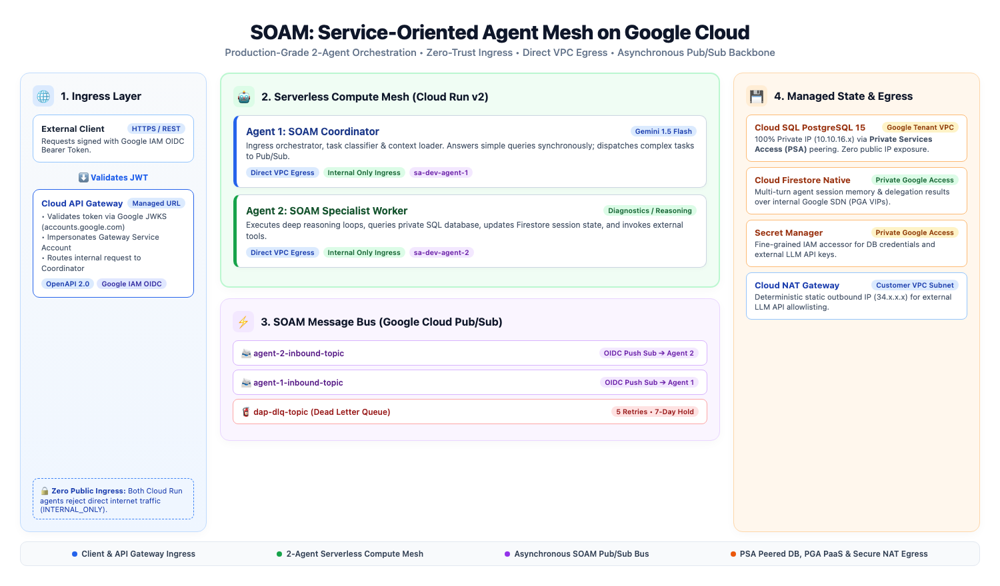
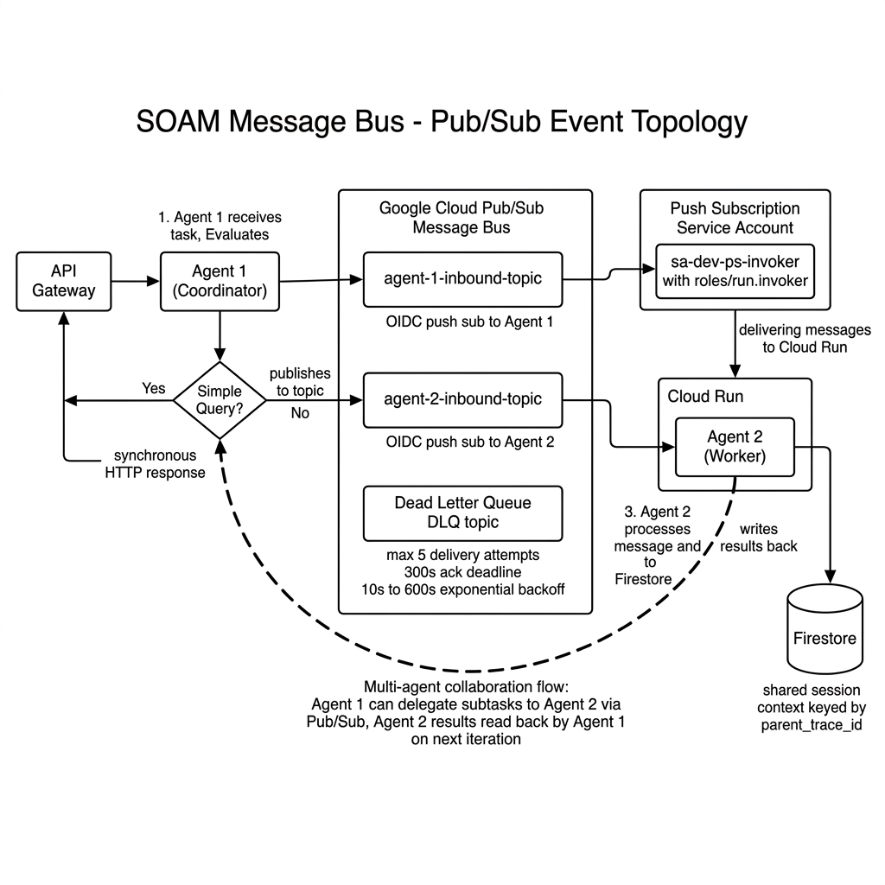
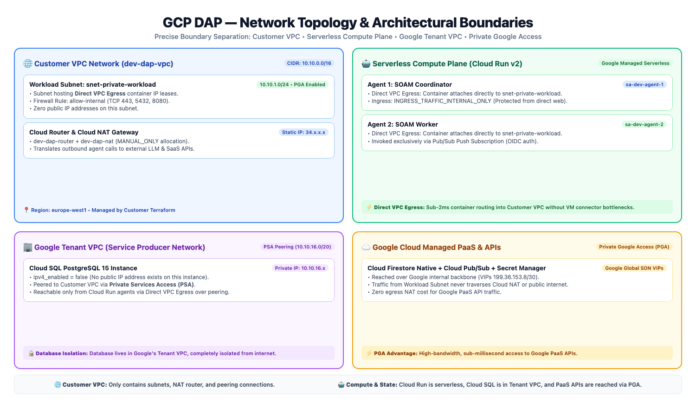
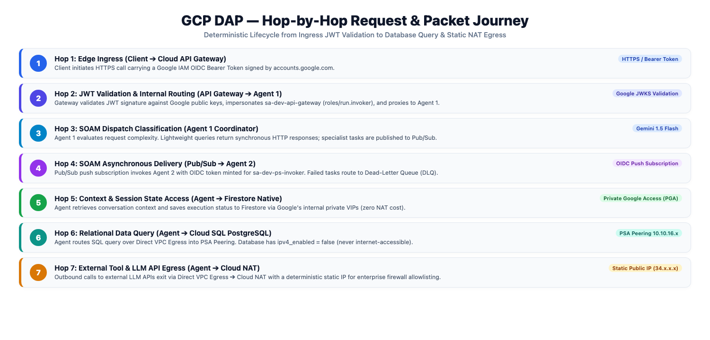
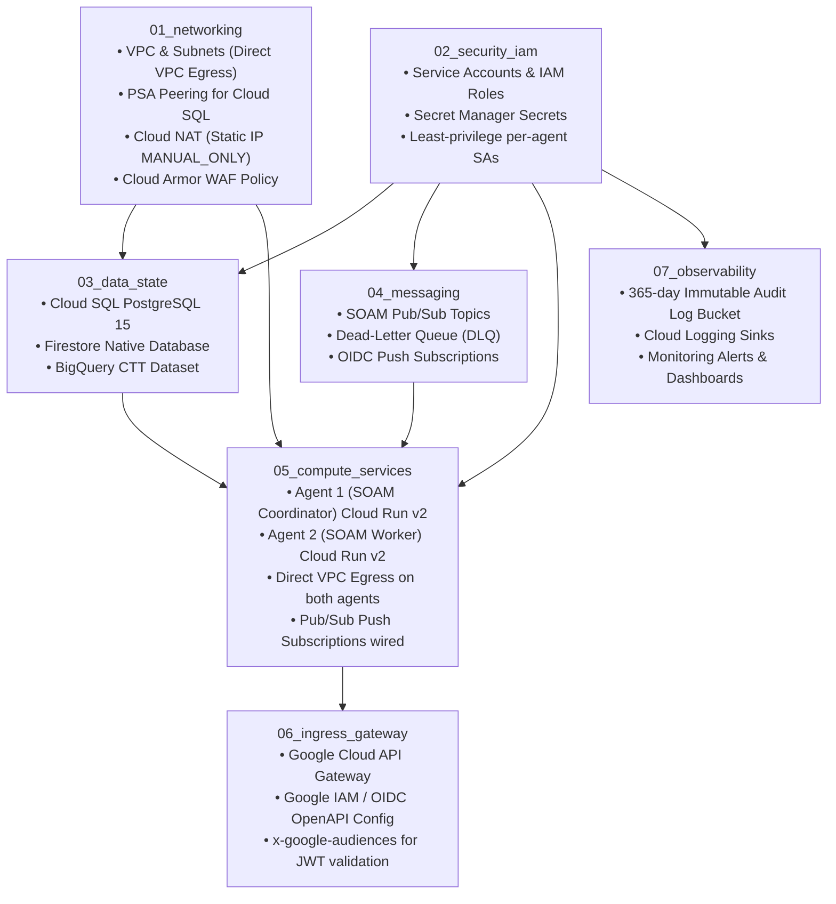

# Enterprise Digital Agent Platform (DAP) — GCP Architecture Guide

## 1. Minimalist 2-Agent Production-Grade SOAM Setup

The **Service-Oriented Agent Mesh (SOAM)** architecture proves end-to-end multi-agent orchestration with a streamlined **2-Agent** footprint while retaining **100% production-grade Zero-Trust security**, private networking, and asynchronous event-driven orchestration.



### Core Layers of the 2-Agent SOAM Mesh

| Layer | Component | Implementation | Security & Production Hardening |
|---|---|---|---|
| **Layer 1 — Edge Ingress** | Google Cloud API Gateway | OpenAPI 2.0 spec routing `/v1/agent1/tasks` and `/v1/agent2/tasks` | Google IAM / Google OIDC JWT validation via `accounts.google.com`, Gateway Service Account `roles/run.invoker` |
| **Layer 2 — SOAM Compute Mesh** | Agent 1 (SOAM Coordinator) | Cloud Run v2 (`dev-dap-agent-1`) | `INGRESS_TRAFFIC_INTERNAL_ONLY`, Direct VPC Egress, scales to zero ($0 idle) |
| **Layer 2 — SOAM Compute Mesh** | Agent 2 (SOAM Worker) | Cloud Run v2 (`dev-dap-agent-2`) | `INGRESS_TRAFFIC_INTERNAL_ONLY`, Direct VPC Egress, scales to zero ($0 idle) |
| **Layer 3 — SOAM Message Bus** | Pub/Sub Event Backbone | `agent-1-inbound-topic`, `agent-2-inbound-topic`, `dap-dlq-topic` | OIDC-authenticated Push Subscriptions via `sa-dev-ps-invoker`, DLQ after 5 retries, 300s ack deadline |
| **Layer 4 — Data & State** | Cloud SQL PostgreSQL 15 | `dev-dap-agent-sql` (`db-f1-micro`, 10 GB SSD) | Private IP only via PSA Peering (`10.10.16.x`), Zero Public IP |
| **Layer 4 — Data & State** | Cloud Firestore Native | Native Document Database `(default)` | Agent session memory & multi-turn dialog context via Private Google Access (PGA) |
| **Layer 4 — Data & State** | Secret Manager | Google-managed encrypted vault | Fine-grained IAM accessor roles; injects LLM API keys directly into agents |
| **Layer 5 — External Egress** | Cloud NAT Gateway | Cloud Router + Static IP (`MANUAL_ONLY`) | Agents make LLM/SaaS calls directly through VPC → Cloud NAT → Static Public IP (`34.x.x.x`); databases have no path to Cloud NAT |

---

## 2. SOAM — Service-Oriented Agent Mesh

**SOAM** is the core architectural pattern governing how agents in this platform receive tasks, collaborate, delegate subtasks, and process results at scale. It is an **async-first, event-driven** design where agents are fully decoupled from each other and communicate exclusively through the Pub/Sub message bus.



### 2.1 SOAM Core Principles

| Principle | Description | Implementation |
| :--- | :--- | :--- |
| **Async-First Dispatch** | All complex agent tasks are dispatched asynchronously via durable Pub/Sub queues — no blocking HTTP calls between agents | `agent-1-inbound-topic`, `agent-2-inbound-topic` with OIDC-authenticated Cloud Run push endpoints |
| **Sync Fallback for Simple Queries** | Low-latency lookups bypass the async pipeline and return synchronous HTTP responses directly | Agent 1 evaluates request complexity and returns inline for simple lookups and health checks |
| **Event-Driven Decoupling** | Agent 1 and Agent 2 do not call each other directly — they only read from their own inbound topic | Agent 1 publishes to `agent-2-inbound-topic`; Agent 2 subscribes and processes independently |
| **Idempotent Task Delivery** | Tasks are safely re-delivered on failure without producing duplicate side effects | `ack_deadline_seconds = 300`, `max_delivery_attempts = 5`, `min_backoff = 10s`, `max_backoff = 600s` |
| **Multi-Agent Collaboration** | Agent 1 can delegate subtasks to Agent 2 via the SOAM bus and read results from shared Firestore state | Agent 1 publishes `{ target_agent, parent_trace_id, task_payload }` to Agent 2's inbound topic; results are written to Firestore keyed by `parent_trace_id` |
| **Dead-Letter Resilience** | Messages that exceed 5 delivery attempts are routed to `dap-dlq-topic` for forensic inspection and retry | DLQ topic with 7-day message retention; ops team can replay or inspect failed messages |

---

### 2.2 SOAM Message Lifecycle

```text
┌──────────────────────────────────────────────────────────────────────┐
│                        SOAM TASK LIFECYCLE                           │
│                                                                      │
│  [Client Request] + Google IAM OIDC Bearer Token                    │
│        │                                                             │
│        ▼  (HTTPS via Google Cloud API Gateway)                      │
│  ┌─────────────────────────────────────────┐                        │
│  │  Agent 1 — SOAM Coordinator             │                        │
│  │                                         │                        │
│  │  1. Receive and parse the task          │                        │
│  │  2. Load session context from Firestore │                        │
│  │  3a. Lightweight? ─► Sync HTTP response │                        │
│  │  3b. Complex task? ─► Publish to Pub/Sub│                        │
│  └─────────────────┬───────────────────────┘                        │
│                    │ PUBLISH                                         │
│                    ▼                                                 │
│  ┌──────────────────────────────────────────────────────────────┐   │
│  │  SOAM Message Bus — Google Cloud Pub/Sub                     │   │
│  │                                                              │   │
│  │  [agent-2-inbound-topic]  ──PUSH──►  [Agent 2 Worker]       │   │
│  │                                                              │   │
│  │  Delivery config:                                            │   │
│  │    ack_deadline     = 300s                                   │   │
│  │    max_retries      = 5                                      │   │
│  │    min_backoff      = 10s                                    │   │
│  │    max_backoff      = 600s                                   │   │
│  │                                                              │   │
│  │  On failure → [dap-dlq-topic] (7-day forensic retention)    │   │
│  └─────────────────────────────┬────────────────────────────────┘   │
│                                │ PUSH (OIDC auth via sa-dev-ps-invoker) │
│                                ▼                                    │
│  ┌──────────────────────────────────────────────────────────────┐   │
│  │  Agent 2 — SOAM Worker (Cloud Run v2, Direct VPC Egress)     │   │
│  │                                                              │   │
│  │    ├─ Load context ─────────────────► Firestore (PGA)        │   │
│  │    ├─ Read structured data ─────────► Cloud SQL (PSA)        │   │
│  │    ├─ Call external LLM / SaaS ─────► Cloud NAT → Internet   │   │
│  │    │    (API keys from Secret Manager)                       │   │
│  │    └─ Write results to Firestore ──► keyed by parent_trace_id│   │
│  └──────────────────────────────────────────────────────────────┘   │
│                                                                      │
│  Agent 1 reads results from Firestore on next reasoning loop         │
└──────────────────────────────────────────────────────────────────────┘
```

---

### 2.3 SOAM Agent Roles

| Agent | SOAM Role | Ingress | VPC Egress | State |
| :--- | :--- | :--- | :--- | :--- |
| **Agent 1** | **SOAM Coordinator** — Entry point, task classifier, Pub/Sub publisher, context loader, multi-agent delegator | `INTERNAL_ONLY` | Direct VPC Egress + Cloud NAT | Firestore (session state) + Cloud SQL |
| **Agent 2** | **SOAM Worker** — Pulls subtasks from `agent-2-inbound-topic`, executes LLM reasoning loops, calls external tools | `INTERNAL_ONLY` | Direct VPC Egress + Cloud NAT | Firestore (results) + Cloud SQL |

---

### 2.4 SOAM Pub/Sub Topic Topology

```text
   ┌────────────────────────────────────────────────────────────────┐
   │               SOAM Message Bus (Google Cloud Pub/Sub)          │
   │                                                                │
   │  [agent-1-inbound-topic]   → OIDC Push Sub → Agent 1          │
   │  [agent-2-inbound-topic]   → OIDC Push Sub → Agent 2          │
   │                                                                │
   │  [dap-dlq-topic]           ← All subscriptions after 5 retries│
   │    (7-day message retention for forensic replay)               │
   └────────────────────────────────────────────────────────────────┘

   Per-Subscription Reliability Config:
   ├── ack_deadline_seconds    = 300   (5 min for LLM reasoning)
   ├── max_delivery_attempts   = 5
   ├── minimum_backoff         = 10s
   └── maximum_backoff         = 600s

   Auth:
   └── Push subscriptions authenticated via sa-dev-ps-invoker (roles/run.invoker)
       so only authorised Pub/Sub service account can invoke Cloud Run endpoints.
```

---

### 2.5 SOAM Multi-Agent Collaboration

When Agent 1's reasoning determines a subtask requires delegation to Agent 2:

```text
Agent 1 (Coordinator — reasoning loop)
  │
  ├─ 1. Identifies need for specialised subtask
  │
  ├─ 2. Publishes delegation message to agent-2-inbound-topic:
  │      {
  │        "target_agent"  : "agent-2",
  │        "parent_trace_id": "trace-abc123",
  │        "task_payload"  : { ... }
  │      }
  │
  └─ 3. Agent 2 receives push message, executes subtask:
             │
             ├─ Calls external LLM via Cloud NAT (Static Public IP)
             ├─ Fetches API credentials from Secret Manager
             └─ Writes result to Firestore:
                  /sessions/{parent_trace_id}/agent_2_result

Agent 1 reads Firestore result on next reasoning iteration
and incorporates Agent 2's output into the final response.
```

This pattern enables **horizontal multi-agent collaboration** with zero direct coupling — agents never call each other over HTTP. All communication is through the SOAM Pub/Sub bus.

---

## 3. Network Topology & VPC Design

### Why a Customer VPC is Required in a Serverless Platform

Even though compute (Cloud Run), state (Firestore), and messaging (Pub/Sub) are serverless, the **Customer VPC** is essential for 4 production requirements:

1. 🔒 **Private Cloud SQL Access (Zero Public IP for DB)**
   - Cloud SQL lives inside Google's *Service Producer Tenant VPC*.
   - Cloud Run connects to the Customer VPC via Direct VPC Egress, which transits via **Private Services Access (PSA)** peering into the Tenant VPC (`10.10.16.x`). The database is never internet-exposed.

2. 🛡️ **Predictable Static Public IP for Agent Egress (Cloud NAT)**
   - When agents call external LLMs or enterprise SaaS APIs, those providers require **IP allowlisting**.
   - Cloud NAT (`MANUAL_ONLY`) ensures all agent outbound traffic exits via a single, deterministic **Static Public IP (`34.x.x.x`)**.

3. ⚡ **Private Google Access (PGA)**
   - `private_ip_google_access = true` on the subnet causes `*.googleapis.com` DNS to resolve to Google Private VIPs (`199.36.153.8/30`).
   - Firestore, BigQuery, Pub/Sub, and Secret Manager are reached over Google's **internal backbone**, never via Cloud NAT.

4. 🏢 **Enterprise Compliance & Future Hybrid Connectivity**
   - Foundation for **VPC Service Controls** perimeters to prevent data exfiltration.
   - Enables future **Cloud VPN** or **Dedicated Interconnect** to on-premises systems.



### Architectural Domains & Boundary Isolation

| Architectural Domain | Managed By | Components | Network Isolation / Reachability |
|---|---|---|---|
| **1. Customer VPC Network** | Customer Terraform | `snet-private-workload` (`10.10.1.0/24`), Cloud Router & Cloud NAT (`34.x.x.x`), PSA Range (`10.10.16.0/20`), Firewall Rules | Isolated private VPC in `europe-west1`; hosts Direct VPC Egress interface bindings; zero public IP on workload subnet |
| **2. Serverless Compute Plane** | Google Cloud (Cloud Run v2) | `dev-dap-agent-1` (Coordinator), `dev-dap-agent-2` (Worker) | Serverless microservices (`INTERNAL_ONLY` ingress); attaches to Customer VPC via **Direct VPC Egress** (`network_interfaces`) |
| **3. Google Managed Tenant VPC** | Google Cloud (Service Networking) | Cloud SQL PostgreSQL 15 (`10.10.16.x`) | 100% Private IP (`ipv4_enabled = false`); peered to Customer VPC via **Private Services Access (PSA)** |
| **4. Google Managed PaaS / APIs** | Google Cloud (Global SDN) | Cloud Firestore Native, Cloud Pub/Sub, Secret Manager, BigQuery | Accessed directly from Subnet via **Private Google Access (PGA)** on Google private VIPs (`199.36.153.8/30`); zero internet or NAT traversal |
| **5. Edge Ingress & Egress** | Google Managed Edge | Cloud API Gateway (`*.gateway.dev`), Static Cloud NAT IP (`34.x.x.x`) | Validates external OIDC JWT tokens at edge; routes deterministically to external LLM SaaS APIs |

---

## 4. Hop-by-Hop Packet & Connection Lifecycle



```text
[Client]
   │ (Hop 1) HTTPS + Google IAM OIDC Bearer Token
   ▼
[Google Cloud API Gateway]
   │ (Hop 2) JWT validated against Google JWKS (accounts.google.com)
   │         Gateway Service Account (sa-dev-api-gateway) mints OIDC token
   ▼
[Agent 1 — SOAM Coordinator] (Cloud Run v2, INGRESS_INTERNAL_ONLY)
   │
   ├─ Lightweight query? ──────────────────────────────────────────► Sync HTTP Response
   │
   ├─ (Hop 3) Publish to agent-2-inbound-topic (Pub/Sub)
   │               │
   │               │ (Hop 4) OIDC Push (sa-dev-ps-invoker) to Agent 2
   │               ▼
   │         [Agent 2 — SOAM Worker] (Direct VPC Egress, snet-private-workload)
   │
   ├─ (Hop 5) Read/write session state ──► Cloud Firestore (PGA — Google internal backbone)
   │
   ├─ (Hop 6) Read structured data ──────► Cloud SQL PostgreSQL (PSA Peering, 10.10.16.x)
   │                                        Zero public IP, never internet-routed
   │
   └─ (Hop 7) External LLM / SaaS call:
               Agent → Direct VPC Egress → snet-private-workload
                     → Cloud Router & Cloud NAT
                     → Static Public IP (34.x.x.x)
                     → External LLM APIs (OpenAI / Anthropic / Enterprise SaaS)
```

### Detailed Hop Breakdown

#### 📍 Hop 1: Edge Ingress — Client ➔ Google Cloud API Gateway
- Client sends HTTPS request to `https://dev-dap-gateway-agj0gxxt.ew.gateway.dev` with a Google IAM OIDC Bearer Token.
- Token is signed by `accounts.google.com` and validated against Google's public JWKS endpoint (`https://www.googleapis.com/oauth2/v3/certs`).

#### 📍 Hop 2: Auth & Routing — API Gateway ➔ Agent 1 (Cloud Run)
- API Gateway intercepts the `Authorization: Bearer <JWT>` header, verifies signature and expiry.
- Allowed audiences: `32555940559.apps.googleusercontent.com` (standard `gcloud` SDK client ID).
- Gateway uses `sa-dev-api-gateway` with `roles/run.invoker` to forward the request to Agent 1 over Google's internal proxy network.

#### 📍 Hop 3: SOAM Dispatch Decision — Agent 1
- Agent 1 receives the request and classifies it:
  - **Simple query** → returns sync HTTP response immediately.
  - **Complex task** → publishes a message to `agent-2-inbound-topic` (Pub/Sub async path).

#### 📍 Hop 4: SOAM Async Delivery — Pub/Sub ➔ Agent 2
- Pub/Sub delivers the message to Agent 2 via an **OIDC-authenticated push subscription**.
- `sa-dev-ps-invoker` holds `roles/run.invoker` on Agent 2's Cloud Run service. Pub/Sub supplies this as the OIDC token on each push request.
- Agent 2 is configured with `INGRESS_TRAFFIC_INTERNAL_ONLY` — only this authenticated push can reach it.

#### 📍 Hop 5: State & Context Access — Agent ➔ Cloud Firestore (PGA)
- Agent reads multi-turn dialog context from Firestore keyed by `session_id` / `parent_trace_id`.
- Traffic stays **strictly on Google's internal backbone** via Private Google Access (PGA).
- No internet hop, no Cloud NAT involved.

#### 📍 Hop 6: Relational Data Access — Agent ➔ Cloud SQL (PSA)
- Agent queries Cloud SQL PostgreSQL (`10.10.16.x`) over PSA Peering.
- Cloud SQL has `ipv4_enabled = false` — it is **not reachable from the internet**.
- Agent packet traverses: Direct VPC Egress → `snet-private-workload` → PSA peering → Cloud SQL Tenant VPC.

#### 📍 Hop 7: External LLM / SaaS Tool Call — Agent ➔ Cloud NAT ➔ External APIs
- Agent fetches LLM API credentials from **Secret Manager** (via PGA — no internet hop).
- Agent initiates HTTPS call to external LLM provider (e.g. OpenAI, Anthropic).
- Packet path: Direct VPC Egress → `snet-private-workload` → Cloud Router → Cloud NAT (SNAT to `34.x.x.x`) → external LLM API.
- **The database layer has zero connection to Cloud NAT.** Only the agents make external calls.

---

## 5. Architecture Mapping to Terraform / Terragrunt Modules

The codebase is partitioned into 7 modular building blocks, each with a single responsibility:



### Module Breakdown

| Module | Code Location | Resources Provisioned | Security Controls |
| :--- | :--- | :--- | :--- |
| **01_networking** | `infra/modules/01_networking/` | VPC, Private Subnet (Direct VPC Egress), PSA Peering, Cloud Router, Cloud NAT (static `MANUAL_ONLY` IP), Cloud Armor WAF | Edge DDoS/WAF protection, no connector VMs, private RFC 1918 addressing |
| **02_security_iam** | `infra/modules/02_security_iam/` | `sa-dev-agent-1`, `sa-dev-agent-2`, `sa-dev-ps-invoker`, `sa-dev-api-gateway`; Secret Manager secrets for DB password and LLM API token | Least-privilege IAM per service; no cross-agent SA access |
| **03_data_state** | `infra/modules/03_data_state/` | Cloud SQL PostgreSQL 15, Firestore Native `(default)`, BigQuery CTT dataset | Private IP only, PSA Peering, PGA transit, zero public exposure |
| **04_messaging** | `infra/modules/04_messaging/` | `agent-1-inbound-topic`, `agent-2-inbound-topic`, `dap-dlq-topic`, OIDC push subscriptions | OIDC auth via `sa-dev-ps-invoker`, 5-retry DLQ, 10s–600s exponential backoff |
| **05_compute_services** | `infra/modules/05_compute_services/` | Agent 1 & Agent 2 Cloud Run v2 services, Direct VPC Egress on both, `INGRESS_TRAFFIC_INTERNAL_ONLY`, Pub/Sub push sub wiring | OIDC Pub/Sub push auth, internal-only ingress enforced |
| **06_ingress_gateway** | `infra/modules/06_ingress_gateway/` | Google Cloud API Gateway, OpenAPI spec with Google IAM OIDC `x-google-issuer`/`x-google-jwks_uri`/`x-google-audiences` | Google IAM / OIDC JWT validation; `sa-dev-api-gateway` with `roles/run.invoker` |
| **07_observability** | `infra/modules/07_observability/` | Cloud Storage Audit Bucket (365-day retention, Object Lock), Cloud Logging Sink, Alert Policies | Immutable compliance audit trails, operational alerting |

---

## 6. End-to-End Execution Flow

```text
[Client Request] + Google IAM OIDC Bearer Token
       │
       ▼
1. Google Cloud API Gateway
       │  Validates token (accounts.google.com JWKS)
       │  Routes to Agent 1 via Gateway Service Account (roles/run.invoker)
       ▼
2. Agent 1 — SOAM Coordinator (Cloud Run v2)
       │
       ├── Simple query? ──────────────────────────────────────► Sync HTTP Response
       │
       └── Complex task? ──► Publish to [agent-2-inbound-topic]
                                   │
                                   │ (OIDC push via sa-dev-ps-invoker)
                                   ▼
                        3. Agent 2 — SOAM Worker (Cloud Run v2)
                                   │
                                   ├──► Load session context ─────► Firestore (PGA)
                                   ├──► Read structured data ──────► Cloud SQL (PSA)
                                   ├──► Fetch API credentials ─────► Secret Manager (PGA)
                                   ├──► Call external LLM/SaaS ────► Cloud NAT → Internet
                                   └──► Write result to Firestore ─► keyed by parent_trace_id
                                   │
                        4. Agent 1 reads Agent 2 result from Firestore
                           and composes final response → Client
```

### Execution Steps in Detail

1. **Request Ingestion**:
   - A client sends a request to the **API Gateway** with a Google IAM OIDC Bearer Token.
   - The API Gateway verifies the JWT against **Google's JWKS** endpoint (`https://www.googleapis.com/oauth2/v3/certs`) and routes the request to **Agent 1** (SOAM Coordinator).

2. **SOAM Dispatch Decision (Agent 1)**:
   - Agent 1 classifies the request. Simple queries (health, registry lookups) return synchronously.
   - Complex AI tasks publish a delegation message to `agent-2-inbound-topic` (SOAM async path).

3. **SOAM Worker Execution (Agent 2)**:
   - Agent 2 receives the push-delivered message (authenticated via `sa-dev-ps-invoker`).
   - Loads session context from **Firestore** (PGA), reads relational data from **Cloud SQL** (PSA Peering).
   - Fetches LLM API credentials from **Secret Manager** and calls external LLM via **Cloud NAT** (static public IP).
   - Writes results back to **Firestore** keyed by `parent_trace_id`.

4. **Result Aggregation**:
   - Agent 1 reads Agent 2's Firestore result on its next reasoning iteration and composes the final response to the client.
