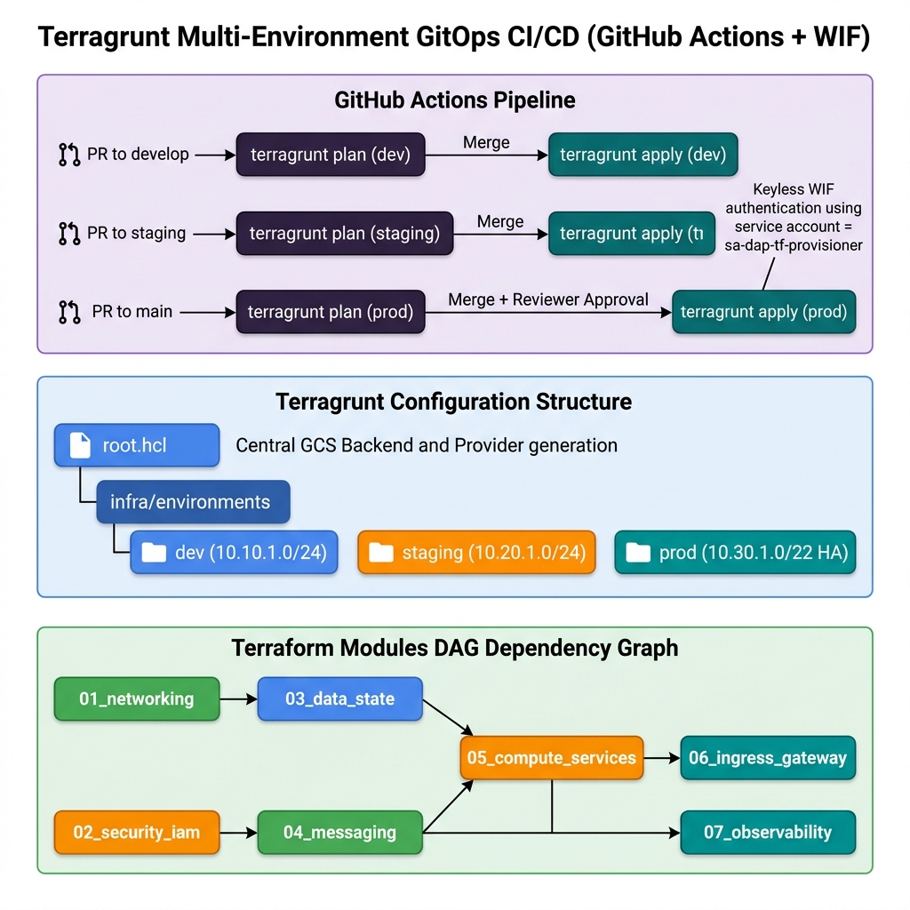
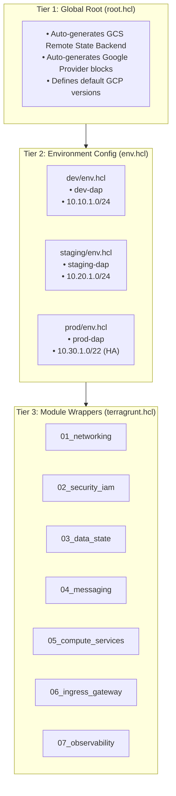
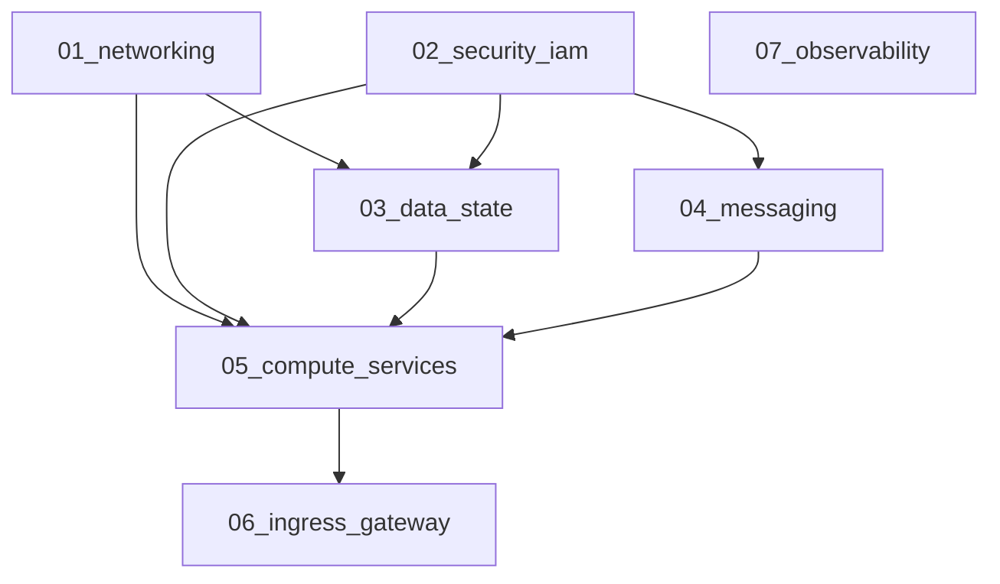

# Terragrunt Multi-Environment Architecture & Operations Guide

This document provides a comprehensive technical guide to how **Terragrunt** orchestrates multi-environment GCP infrastructure (`dev`, `staging`, `prod`) with zero duplication, isolated state files, automated dependency orchestration, and GitHub Actions CI/CD integration.

---

### 🎨 Multi-Environment Architecture & CI/CD Diagram



---

## 1. The 3-Tier Hierarchical Model

Terragrunt eliminates code duplication across environments by separating **global standards**, **environment parameters**, and **module execution**:



---

## 2. Directory Structure

```text
SOAM/
├── .github/
│   └── workflows/
│       └── terragrunt-gcp.yml        # Multi-environment CI/CD workflow (WIF Keyless Auth)
│
├── apps/                             # AI Agent Microservices Source Code
│   ├── coordinator/                  # Agent 1 (SOAM Coordinator & Reasoning Engine)
│   └── worker/                       # Agent 2 (SOAM Specialist Worker & Diagnostics)
│
├── infra/
│   ├── modules/                      # 📦 Reusable Terraform Modules (Source of Truth)
│   │   ├── 01_networking/
│   │   ├── 02_security_iam/
│   │   ├── 03_data_state/
│   │   ├── 04_messaging/
│   │   ├── 05_compute_services/
│   │   ├── 06_ingress_gateway/
│   │   └── 07_observability/
│   │
│   └── environments/                 # ⚡ Terragrunt Multi-Environment Deployments
│       ├── root.hcl                  # 🌐 Global Root: Auto GCS Remote State & Provider generation
│       │
│       ├── dev/                      # 🧪 Dev Environment (dev-dap)
│       │   ├── env.hcl
│       │   ├── 01_networking/terragrunt.hcl
│       │   ├── 02_security_iam/terragrunt.hcl
│       │   ├── 03_data_state/terragrunt.hcl
│       │   ├── 04_messaging/terragrunt.hcl
│       │   ├── 05_compute_services/terragrunt.hcl
│       │   ├── 06_ingress_gateway/terragrunt.hcl
│       │   └── 07_observability/terragrunt.hcl
│       │
│       ├── staging/                  # 🚀 Staging Environment (staging-dap)
│       │   ├── env.hcl
│       │   └── ... (01 through 07)
│       │
│       └── prod/                     # 🛡️ Production Environment (prod-dap)
│           ├── env.hcl
│           └── ... (01 through 07)
```

---

## 3. Anatomy of a `terragrunt.hcl` File

Each component wrapper (e.g. `01_networking/terragrunt.hcl`) is a lightweight connector:

```hcl
# 1. Inherit remote state bucket & Google provider from root.hcl
include "root" {
  path = find_in_parent_folders("root.hcl")
}

# 2. Dynamically load variables from the parent env.hcl
locals {
  env_vars = read_terragrunt_config(find_in_parent_folders("env.hcl"))
}

# 3. Reference the reusable Terraform source module
terraform {
  source = "../../../modules/01_networking"
}

# 4. Pass dynamic inputs to Terraform variables
inputs = {
  subnet_cidr        = local.env_vars.locals.subnet_cidr
  vpc_connector_cidr = local.env_vars.locals.vpc_connector_cidr
}
```

### Explanation of Components:
* **`include "root"`**: Walks up parent folders to find `root.hcl` and automatically configures the GCS backend (`gs://<project-id>-tfstate-<env>`) and Google Provider.
* **`read_terragrunt_config`**: Reads `env.hcl` and exposes its variables under `local.env_vars.locals`.
* **`terraform { source = ... }`**: Specifies where the underlying Terraform `.tf` files reside. Terragrunt caches and executes inside a temporary sandbox (`.terragrunt-cache/`).
* **`inputs = { ... }`**: Automatically injects values into Terraform module input variables without requiring `.tfvars` files.

---

## 4. Inter-Module Dependency Graph (DAG)

Modules that require outputs from earlier modules use `dependency` blocks:



### Example Dependency Block:
In `03_data_state/terragrunt.hcl`:
```hcl
dependency "networking" {
  config_path = "../01_networking"
  mock_outputs = {
    vpc_id = "projects/mock/global/networks/mock-vpc"
  }
}

inputs = {
  vpc_network_id = dependency.networking.outputs.vpc_id
}
```

---

## 5. Multi-Environment Comparison

| Parameter | Dev (`dev/env.hcl`) | Staging (`staging/env.hcl`) | Prod (`prod/env.hcl`) |
| :--- | :--- | :--- | :--- |
| **GCP Project** | `my-dap-gcp-dev` | `my-dap-gcp-staging` | `my-dap-gcp-prod` |
| **Subnet CIDR** | `10.10.1.0/24` | `10.20.1.0/24` | `10.30.1.0/24` |
| **VPC Connector CIDR** | `10.10.2.0/28` | `10.20.2.0/28` | `10.30.2.0/28` |
| **Cloud SQL Tier** | `db-custom-2-7680` | `db-custom-4-15360` | `db-custom-8-32768` (HA) |
| **Image Tags** | `:latest` | `:staging` | `:v1.0.0` (Release SHA) |
| **Auth Provider** | `Google IAM / OIDC` | `Google IAM / OIDC` | `Google IAM / OIDC` |
| **GCS Remote State** | `gs://my-dap-gcp-dev-tfstate-dev` | `gs://my-dap-gcp-staging-tfstate-staging` | `gs://my-dap-gcp-prod-tfstate-prod` |

---

## 6. Terragrunt CLI Commands Reference

### Deploy / Plan Entire Environment
```bash
cd infra/environments/dev

# 1. Print and inspect the dependency tree
terragrunt dag graph

# 2. Plan all 7 modules in parallel / dependency order
terragrunt run --all plan

# 3. Apply all modules across the DAG
terragrunt run --all apply
```

### Iterate on a Single Module (Reduced Blast Radius)
```bash
cd infra/environments/dev/05_compute_services

terragrunt plan
terragrunt apply
```

### Destroy / Teardown
```bash
cd infra/environments/dev
terragrunt run --all destroy
```

---

## 7. GitHub Actions CI/CD Pipeline

The pipeline at `.github/workflows/terragrunt-gcp.yml` implements automated GitOps:

1. **Pull Request (Branch-Aware Planning)**:
   - PR to **`develop`** ➔ Plans only **`dev`**
   - PR to **`staging`** ➔ Plans only **`staging`**
   - PR to **`main`** ➔ Plans only **`prod`**
2. **Continuous Deployment (Auto-Apply)**:
   - Merge to **`develop`** ➔ Applies `infra/environments/dev`
   - Merge to **`staging`** ➔ Applies `infra/environments/staging`
   - Merge to **`main`** ➔ Applies `infra/environments/prod` (requires manual review)
3. **Manual Dispatch**: Select environment and action (`plan`, `apply`, `destroy`) directly from GitHub Actions UI.
