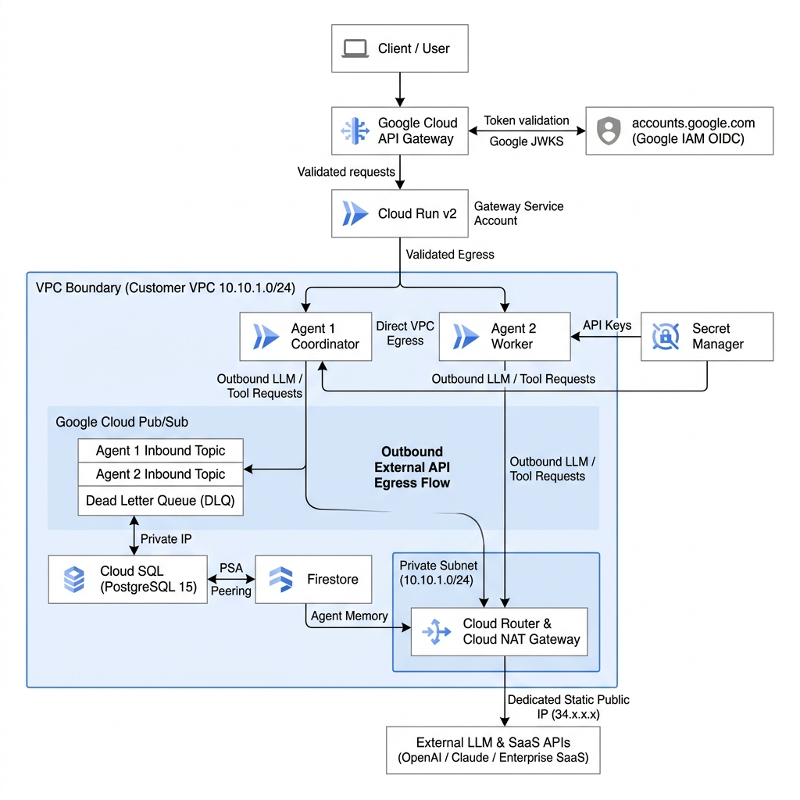
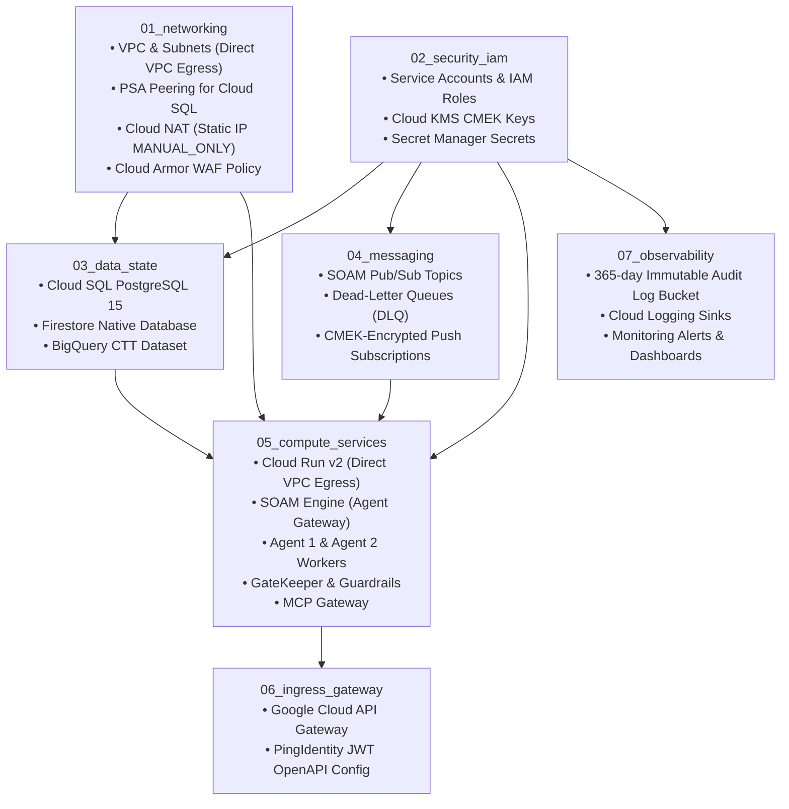

# Enterprise Digital Agent Platform (DAP) - GCP Architecture Guide

## 1. Minimalist 2-Agent Production-Grade SOAM Setup (Core Proof of Architecture)

The **Service-Oriented Agent Mesh (SOAM)** architecture can be proven end-to-end with a streamlined **2-Agent** footprint while retaining **100% production-grade Zero-Trust security**, private networking, and asynchronous event-driven orchestration.



### Core Components of the 2-Agent SOAM Mesh:

| Layer | Component | Implementation | Security & Production Hardening |
|---|---|---|---|
| **Edge Ingress** | Cloud API Gateway | Open API 2.0 definition routing `/v1/agent1/tasks` and `/v1/agent2/tasks` | Google IAM / Google OIDC JWT validation, SSL termination, IAM token exchange |
| **Compute** | Agent 1 (Coordinator) | Cloud Run v2 (`dev-dap-agent-1`) | `INGRESS_TRAFFIC_INTERNAL_ONLY`, Direct VPC Egress, scales to zero ($0 idle) |
| **Compute** | Agent 2 (Worker) | Cloud Run v2 (`dev-dap-agent-2`) | `INGRESS_TRAFFIC_INTERNAL_ONLY`, Direct VPC Egress, scales to zero ($0 idle) |
| **Messaging** | Pub/Sub Event Backbone | `agent-1-inbound-topic`, `agent-2-inbound-topic`, `dlq-topic` | OIDC-authenticated Push Subscriptions via `sa-dev-ps-invoker`, DLQ after 5 retries |
| **Relational Data** | Cloud SQL | PostgreSQL 15 (`db-f1-micro`, 10GB SSD) | Private IP only (PSA Peering), Zero Public IP, automated backups |
| **State & Memory** | Firestore Native | Native Document Database `(default)` | Sub-millisecond session scratchpad & multi-turn dialog memory via Private Google Access |
| **Secrets & Keys** | Secret Manager | Google-managed encrypted secret vault | Fine-grained IAM accessor roles for DB credentials and LLM tokens |
| **Egress Routing** | Cloud NAT Gateway | Cloud Router + Static IP | Predictable, allowlistable outbound IP for external LLM API calls |

---

## 2. Complete Enterprise Reference Topology (Full Ecosystem)


### Key Network Boundaries:
1. **Customer Custom VPC (`10.10.0.0/16`)**:
   - `snet-private-workload` (`10.10.1.0/24`): Subnet with **Private Google Access (PGA)** enabled. Cloud Run instances attach **directly** to this subnet via **Direct VPC Egress** — no proxy VMs.
   - **Cloud Router & Cloud NAT** (Static IP `MANUAL_ONLY`): Provides a deterministic, allowlistable static public IP for external MCP tool API egress.
   - **Reserved PSA Peering Range** (`10.10.16.0/20`): Connects to Google's Service Producer Tenant VPC for Cloud SQL.
   - ~~`snet-vpc-connector` (`10.10.2.0/28`)~~: **Removed** — VPC Access Connector (e2-micro VM fleet) eliminated in favour of Cloud Run Direct VPC Egress.
2. **Google Service Producer Tenant VPC**:
   - Hosts **Cloud SQL (PostgreSQL 15)** instances with private IP addressing (`10.10.16.x`) peered via **Private Services Access (PSA)**.
3. **Google PaaS & Global APIs (Internal Backbone)**:
   - BigQuery, Firestore, Cloud KMS, Secret Manager, and Cloud Pub/Sub accessed privately over Google's internal software-defined network via **Private Google Access (PGA)** (Zero NAT).


---

### 💡 Why is a Customer VPC Required in a Serverless Platform?

Even though compute (Cloud Run), storage (Firestore/BigQuery), and messaging (Pub/Sub) are serverless, a **Customer VPC** is essential for 4 enterprise architectural requirements:

1. 🔒 **Private Cloud SQL Access (Zero Public IP for DB)**:
   - Cloud SQL instances live inside Google's managed *Service Producer Tenant VPC*.
   - Cloud Run cannot peer directly with Google's Tenant VPC. Instead, Cloud Run connects to the **Customer VPC** via **Direct VPC Egress**, which then transits across the **Private Services Access (PSA)** peering connection into the Tenant VPC (`10.10.16.x`). This guarantees that your relational database is never exposed to the public internet.

2. 🛡️ **Predictable Static Public IP for Outbound Tool Egress (Cloud NAT)**:
   - When AI Agents or the MCP Gateway invoke external enterprise APIs, SaaS tools, or partner systems, those third-party firewalls require **IP Allowlisting**.
   - Default serverless Cloud Run egress uses dynamic, rotating Google public IP pools that cannot be allowlisted. By routing outbound traffic through the Customer VPC with **Cloud NAT** (`MANUAL_ONLY` static IP), all egress traffic exits via a single, dedicated **Static Elastic Public IP** (`34.x.x.x`).

3. ⚡ **Private Google Access (PGA) Routing**:
   - The Customer VPC subnet enforces DNS resolution for `*.googleapis.com` to Google's Private VIPs (`199.36.153.8/30`), ensuring that all telemetry to BigQuery and state to Firestore stays strictly on Google's private software-defined network.

4. 🏢 **Enterprise Compliance & Future Hybrid Connectivity**:
   - The Customer VPC provides the foundation for **VPC Service Controls (VPC-SC)** perimeters to prevent data exfiltration.
   - It allows seamless future expansion to on-premises data centers or mainframes via **Cloud VPN** or **Dedicated Interconnect**.

---

## 3. Hop-by-Hop Packet & Connection Lifecycle


```text
[Client] 
   │ (Hop 1: TLS / HTTPS)
   ▼
[Cloud Armor WAF] ──(DDoS & OWASP Check)──► [Cloud API Gateway]
                                                │ (Hop 2: Internal Ingress + JWT Auth)
                                                ▼
                                      [Cloud Run: agent-gateway]
                                                │
                                                ├──(Hop 3: East-West Internal API Call)──► [gatekeeper] ──► [guardrails]
                                                │
                                                ├──(Hop 4: Direct VPC Egress)──► [snet-private-workload 10.10.1.0/24]
                                                │                                            │
                                                │                                            ├──(Hop 5: PSA Peering)──► [Cloud SQL PostgreSQL]
                                                │                                            │
                                                │                                            └──(Hop 6: Cloud NAT Static IP)──► [External MCP Tool APIs]
                                                │
                                                └──(Hop 7: Private Google Access / PGA)──► [BigQuery / Firestore / PubSub / KMS]
```

### Detailed Hop Breakdown:

#### 📍 Hop 1: Edge Ingress & WAF Inspection (Client ➔ Cloud Armor)
* **What happens**: The client request arrives at Google's global edge Anycast IP.
* **Security Inspection**: **Cloud Armor** inspects the HTTP headers and payload against OWASP ModSecurity Core Rule Sets (SQLi, XSS, RCE) and enforces rate limiting rules (max 500 req/min).
* **Action**: Malicious or rate-exceeded requests are blocked with `403 Forbidden` / `429 Too Many Requests` at Google's edge before reaching downstream compute.

#### 📍 Hop 2: Authentication & Gateway Routing (Cloud Armor ➔ Cloud API Gateway ➔ Agent Gateway)
* **What happens**: Clean requests pass from Cloud Armor to **Cloud API Gateway**.
* **Auth Verification**: The API Gateway intercepts the `Authorization: Bearer <JWT>` header and validates cryptographic signature, expiration, and issuer against **PingIdentity's JWKS** endpoint.
* **Routing**: The API Gateway uses its service account (`sa-dev-api-gateway`) with `roles/run.invoker` to mint a Google OIDC identity token and forward the request to the `agent-gateway` Cloud Run service over Google's secure internal proxy network.

#### 📍 Hop 3: East-West Microservice Orchestration (Cloud Run Inter-Service Communication)
* **What happens**: The `agent-gateway` routes tasks to `gatekeeper`, which calls `guardrails` for prompt safety analysis.
* **Security Boundary**: All internal Cloud Run microservices are configured with `ingress = "INGRESS_TRAFFIC_INTERNAL_ONLY"`. Direct public access from the internet is blocked; only authorized calls carrying Google IAM tokens are permitted.

#### 📍 Hop 4: Direct VPC Egress (Cloud Run ➔ snet-private-workload)
* **What happens**: When microservices need to reach a private IP (`10.10.16.x`), Cloud Run uses **Direct VPC Egress** — each instance is assigned an IP directly from `snet-private-workload` (`10.10.1.0/24`).
* **No Proxy VMs**: Unlike the legacy VPC Access Connector (e2-micro VM fleet), Direct VPC Egress places packets directly inside the Customer VPC with zero intermediate proxy hops, eliminating the ~2ms connector overhead and the bottleneck failure domain.

#### 📍 Hop 5: VPC to Cloud SQL (Customer VPC ➔ PSA Peering ➔ Cloud SQL)
* **What happens**: Packets for PostgreSQL port `5432` leave the VPC Egress subnet and target the private IP of the database (`10.10.16.x`).
* **VPC Peering Transit**: Traffic traverses the **Private Services Access (PSA)** peering connection (`servicenetworking.googleapis.com`) into Google's Service Producer Tenant VPC.
* **Zero Public Exposure**: Cloud SQL has `ipv4_enabled = false` and cannot be reached from the internet.

#### 📍 Hop 6: Outbound Tool Egress (Cloud Run ➔ VPC ➔ Cloud NAT ➔ External APIs)
* **What happens**: When `agent-1` or `mcp-gateway` executes an external tool against third-party enterprise REST APIs or LLMs, the egress packet routes through the VPC Egress subnet into the VPC.
* **NAT Translation**: The VPC's default route directs the packet through **Cloud Router** and **Cloud NAT** (`nat_ip_allocate_option = "MANUAL_ONLY"`).
* **Static Egress**: Cloud NAT translates the private IP into a single, predictable **Static Public IP**, allowing enterprise firewalls to whitelist DAP egress traffic.

#### 📍 Hop 7: Private Google Access (Workload ➔ BigQuery / Firestore / KMS / Pub/Sub)
* **What happens**: Workloads stream telemetry to BigQuery, read/write state to Firestore, publish events to Pub/Sub, and fetch secrets from Secret Manager.
* **Private VIP Routing**: With `private_ip_google_access = true` on the subnetwork, DNS queries for `*.googleapis.com` resolve to Google Private VIPs (`199.36.153.8/30`).
* **Internal Backbone**: Traffic travels strictly over Google's internal software-defined network and **never traverses Cloud NAT or the public internet**.

---

## 4. SOAM — Service Oriented Agent Messaging


SOAM (**Service Oriented Agent Messaging**) is the core architectural pattern governing how the Digital Agent Platform (DAP) dispatches, validates, routes, and executes AI agent tasks at scale. It is the operational backbone of the `agent-gateway` service and the `04_messaging` Pub/Sub topology.

---

### 4.1 SOAM Core Principles

| Principle | Description | DAP Implementation |
| :--- | :--- | :--- |
| **Async-First Dispatch** | All complex agent tasks are dispatched asynchronously via durable message queues — no blocking HTTP calls between orchestrator and agent workers | Pub/Sub push subscriptions (`agent-1-inbound`, `agent-2-inbound`) with OIDC-authenticated Cloud Run push endpoints |
| **Sync Fallback for Lightweight Queries** | Simple, low-latency lookups bypass the full async pipeline and return synchronous HTTP responses | Agent Gateway evaluates request complexity and returns inline for registry lookups, health checks, and routing decisions |
| **Event-Driven Decoupling** | The Agent Gateway is the **only** service that knows about the downstream agent topology. Agents do not know about each other. | Agent Gateway publishes to topics; agents subscribe and process independently |
| **Mandatory Safety Gate** | Every task transiting the SOAM bus must pass through `GateKeeper` before reaching any agent | GateKeeper Topic → GateKeeper Service → Guardrails → Agent Inbound Topic (only after `PASS`) |
| **Idempotent Task Delivery** | Tasks can be safely re-delivered without producing duplicate side effects | `ack_deadline_seconds = 300`, `dead_letter_policy.max_delivery_attempts = 5`, `retry_policy.minimum_backoff = "10s"` |
| **Full Audit Traceability** | Every task ingested, dispatched, validated, and processed generates a structured trace event | GateKeeper writes `audit_security_logs` to BigQuery CTT; agents write `agent_telemetry_traces` |
| **Multi-Agent Collaboration** | Agents can spawn sub-tasks and delegate them to peer agents via the same SOAM bus | Agent 1 publishes a subtask to `agent-2-inbound-topic` via Agent Gateway; Agent 2 processes it independently |

---

### 4.2 SOAM Message Lifecycle

```text
┌──────────────────────────────────────────────────────────────────────────────────────┐
│                          SOAM TASK LIFECYCLE                                         │
│                                                                                      │
│  [Client Request]                                                                    │
│        │                                                                             │
│        ▼                                                                             │
│  ┌─────────────────────────────────────────────┐                                    │
│  │  Agent Gateway (SOAM Engine)                │                                    │
│  │                                             │                                    │
│  │  1. Parse & classify incoming request       │                                    │
│  │  2. Enrich with session context (Cloud SQL) │                                    │
│  │  3a. Lightweight? ──► Sync HTTP response    │                                    │
│  │  3b. Complex task? ──► Publish to Pub/Sub   │                                    │
│  └──────────────────────┬──────────────────────┘                                    │
│                         │ PUBLISH                                                    │
│                         ▼ (CMEK-encrypted message)                                  │
│  ┌──────────────────────────────────────────────────────────────────────────────┐   │
│  │  SOAM Message Bus — Pub/Sub (04_messaging)                                   │   │
│  │                                                                              │   │
│  │  [gatekeeper-topic] ──PUSH──► [GateKeeper Service]                          │   │
│  │                                       │                                      │   │
│  │                              ┌────────┴────────┐                             │   │
│  │                         PASS │                 │ BLOCK                       │   │
│  │                              ▼                 ▼                             │   │
│  │              [agent-1-inbound-topic]   [audit_security_logs]                 │   │
│  │              [agent-2-inbound-topic]   (BigQuery CTT)                        │   │
│  │                                                                              │   │
│  │  DLQ: max 5 retries → [dap-dlq-topic] (7-day retention for forensics)       │   │
│  └─────────────────────────────┬────────────────────────────────────────────────┘  │
│                                │ PUSH (OIDC token, 300s ack deadline)               │
│                                ▼                                                    │
│  ┌─────────────────────────────────────────────────────────────────────────────┐    │
│  │  Agent Workspace (05_compute_services)                                       │   │
│  │                                                                              │   │
│  │  Agent 1 / Agent 2 (Cloud Run, min 1 instance)                               │   │
│  │    │                                                                         │   │
│  │    ├─ Load context ──────────────────────────────► Firestore (PGA)           │   │
│  │    ├─ Resolve agent ────────────────────────────► Agent Registry (PSA/SQL)   │   │
│  │    ├─ Execute tool ──► MCP Gateway ──► Cloud NAT ─► External APIs            │   │
│  │    ├─ Delegate task ──► Agent Gateway ──► Agent 2 (SOAM multi-agent)        │   │
│  │    └─ Stream telemetry ─────────────────────────► BigQuery CTT (PGA)         │   │
│  └─────────────────────────────────────────────────────────────────────────────┘   │
└──────────────────────────────────────────────────────────────────────────────────────┘
```

---

### 4.3 SOAM Services & Their Roles

| Service | SOAM Role | Cloud Run Ingress | VPC Access | State Store |
| :--- | :--- | :--- | :--- | :--- |
| **Agent Gateway** | **SOAM Engine** — entry point, task classifier, Pub/Sub publisher, multi-agent coordinator | `INTERNAL_ONLY` | Direct VPC Egress | Cloud SQL (`agent_gateway` DB) |
| **GateKeeper** | **SOAM Safety Gate** — intercepts every message on the bus, runs prompt safety & scope checks | `INTERNAL_ONLY` | Direct VPC Egress | BigQuery CTT (audit log write) |
| **Guardrails** | **SOAM Policy Engine** — content policy evaluation, called synchronously by GateKeeper | `INTERNAL_ONLY` | None (PGA only) | None |
| **Agent 1 / Agent 2** | **SOAM Worker Agents** — pull tasks from inbound topics, execute LLM reasoning loops | `INTERNAL_ONLY` | Direct VPC Egress | Firestore (state) + Cloud SQL (registry) |
| **Agent Registry** | **SOAM Service Discovery** — maps agent IDs to capabilities and Cloud Run URLs | `INTERNAL_ONLY` | Direct VPC Egress | Cloud SQL (`agent_registry` DB) |
| **MCP Gateway** | **SOAM Tool Executor** — model context protocol proxy to external enterprise APIs | `INTERNAL_ONLY` | Direct VPC Egress + Cloud NAT | Secret Manager (API credentials) |
| **Grid Monitoring** | **SOAM Telemetry Sink** — aggregates step-level traces and token usage | `INTERNAL_ONLY` | None (PGA only) | BigQuery CTT |
| **Grid Lens** | **SOAM Observability UI** — admin dashboard for live request flows and agent health | `INTERNAL_LOAD_BALANCER` | None | BigQuery CTT (read) |

---

### 4.4 SOAM Pub/Sub Topic Topology

```text
   ┌─────────────────────────────────────────────────────────────┐
   │            SOAM Message Bus (CMEK Encrypted Pub/Sub)        │
   │                                                             │
   │  [gatekeeper-topic]          → GateKeeper Push Sub          │
   │  [agent-1-inbound-topic]     → Agent 1 Push Sub             │
   │  [agent-2-inbound-topic]     → Agent 2 Push Sub             │
   │  [agent-gateway-topic]       → Agent Gateway Pull Sub        │
   │                                                             │
   │  [dap-dlq-topic]             ← All subscriptions (DLQ)      │
   │    (7-day retention, CMEK)                                   │
   └─────────────────────────────────────────────────────────────┘

   Per-Subscription Reliability Config:
   ├── ack_deadline_seconds    = 300 (5 min for LLM reasoning)
   ├── max_delivery_attempts   = 5
   ├── minimum_backoff         = 10s
   └── maximum_backoff         = 600s
```

---

### 4.5 SOAM Multi-Agent Collaboration Flow

When Agent 1's reasoning determines a task requires a different specialist (Agent 2):

```text
Agent 1 (Reasoning Loop)
  │
  ├── 1. Resolves Agent 2's capabilities via Agent Registry (Cloud SQL)
  │
  ├── 2. Publishes a sub-task message to Agent Gateway
  │         {
  │           "target_agent": "agent-2",
  │           "parent_trace_id": "trace-xyz",
  │           "task_payload": { ... }
  │         }
  │
  └── 3. Agent Gateway validates + publishes to [agent-2-inbound-topic]
              │
              ▼
         Agent 2 processes sub-task independently
              │
              └── Results written to shared Firestore session context
                  (keyed by parent_trace_id for Agent 1 to read on next loop)
```

This pattern enables **horizontal multi-agent collaboration** without direct point-to-point coupling — agents communicate exclusively through the SOAM bus.

---

## 5. Architecture Mapping to Terraform / Terragrunt Modules

The codebase is partitioned into 7 modular building blocks:



### Module Breakdown:

| Module | Code Location | Resources Provisioned | Security Controls |
| :--- | :--- | :--- | :--- |
| **01_networking** | `modules/01_networking/` | VPC, Private Subnet (Direct VPC Egress), PSA Peering, Cloud Router, Cloud NAT (static MANUAL_ONLY IP), Cloud Armor | Edge DDoS/WAF protection, no connector VMs, private RFC 1918 addressing |
| **02_security_iam** | `modules/02_security_iam/` | Dedicated SAs (`sa-agent-1`, `sa-gatekeeper`, etc.), Cloud KMS Keyrings/Keys, Secret Manager | Least-privilege IAM, envelope encryption with CMEK |
| **03_data_state** | `modules/03_data_state/` | Private Cloud SQL (Postgres 15 × 2: Registry + SOAM Gateway DB), Firestore Native, BigQuery CTT Telemetry Dataset | Private IP only, KMS disk encryption, PGA transit |
| **04_messaging** | `modules/04_messaging/` | SOAM Pub/Sub Topics (`agent-1-inbound`, `agent-2-inbound`, `gatekeeper-topic`, `agent-gateway-topic`), DLQ, CMEK Push Subs | OIDC auth, 5-retry DLQ, 10s-600s backoff |
| **05_compute_services** | `modules/05_compute_services/` | Cloud Run v2 services (9 microservices, Direct VPC Egress, `INGRESS_TRAFFIC_INTERNAL_ONLY`, `min_instance_count ≥ 1`) | SOAM role separation, OIDC Pub/Sub push auth |
| **06_ingress_gateway** | `modules/06_ingress_gateway/` | Google Cloud API Gateway, API Config, OpenAPI Specs with PingIdentity JWT security definitions | OAuth2/OIDC JWT validation, rate limiting |
| **07_observability** | `modules/07_observability/` | Cloud Storage Audit Bucket (365-day retention, Object Lock), Cloud Logging Sink, Alert Policies | Immutable compliance audit trails, operational metrics |

---

## 6. End-to-End Execution Flow

```text
[Client Request]
       │
       ▼
1. Cloud Armor WAF (Rate Limiting & OWASP Rules)
       │
       ▼
2. API Gateway (Validates PingIdentity JWT Token)
       │
       ▼
3. Agent Gateway — SOAM Engine (Cloud Run)
       │
       ├── Lightweight query? ──► Sync response (no Pub/Sub)
       │
       └── Complex task? ──► Publish to [gatekeeper-topic]
                                   │
                                   ▼
                        4. GateKeeper + Guardrails (Safety Validation)
                                   │
                              PASS │        BLOCK ──► audit_security_logs (BigQuery)
                                   ▼
                        Publish to [agent-1-inbound-topic]
                                   │
                                   ▼
                        5. Agent 1 (Cloud Run Reasoning Worker)
                                   │
                                   ├──► Loads context from Firestore (PGA)
                                   ├──► Queries Agent Registry DB (PSA/Cloud SQL)
                                   ├──► Tool call via MCP Gateway → Cloud NAT → External APIs
                                   ├──► Multi-agent delegation → Agent 2 (via SOAM bus)
                                   └──► Streams telemetry → BigQuery CTT (PGA)
                                   │
                                   ▼
                        6. Response via Agent Gateway & API Gateway → Client
```

### Execution Steps in Detail:

1. **Request Ingestion**:
   * A client sends a request to the **API Gateway** through **Cloud Armor WAF**.
   * The API Gateway verifies the JWT against **PingIdentity's JWKS** endpoint and routes the request to **Agent Gateway** (SOAM Engine).

2. **SOAM Dispatch Decision**:
   * The **Agent Gateway** classifies the request. Lightweight queries (health, registry lookups) return synchronously.
   * Complex AI tasks are published to the **GateKeeper Pub/Sub Topic** (SOAM async path).

3. **SOAM Safety Gate**:
   * **GateKeeper** validates payload safety with **Guardrails** (prompt injection, scope, content policy).
   * Blocked requests are logged to `audit_security_logs` in BigQuery CTT. Passed requests are forwarded to the appropriate **Agent Inbound Topic**.

4. **Agent Reasoning & Execution**:
   * **Agent 1** pulls the task, loads conversation context from **Firestore**, and calls the LLM (Vertex AI via PGA).
   * If a tool is required, Agent 1 calls **MCP Gateway**, which executes the tool against the **External API** using credentials from **Secret Manager**.

5. **Multi-Agent Collaboration**:
   * Agent 1 queries the **Agent Registry** to resolve **Agent 2**, and delegates subtasks back through the **SOAM bus** (Agent Gateway → `agent-2-inbound-topic`).

6. **Telemetry & Audit**:
   * Step latency and token consumption are pushed to **Grid Monitoring** and archived in **CTT BigQuery** (`agent_telemetry_traces` table).
   * Admins inspect live telemetry and request flows in **Grid Lens**.
