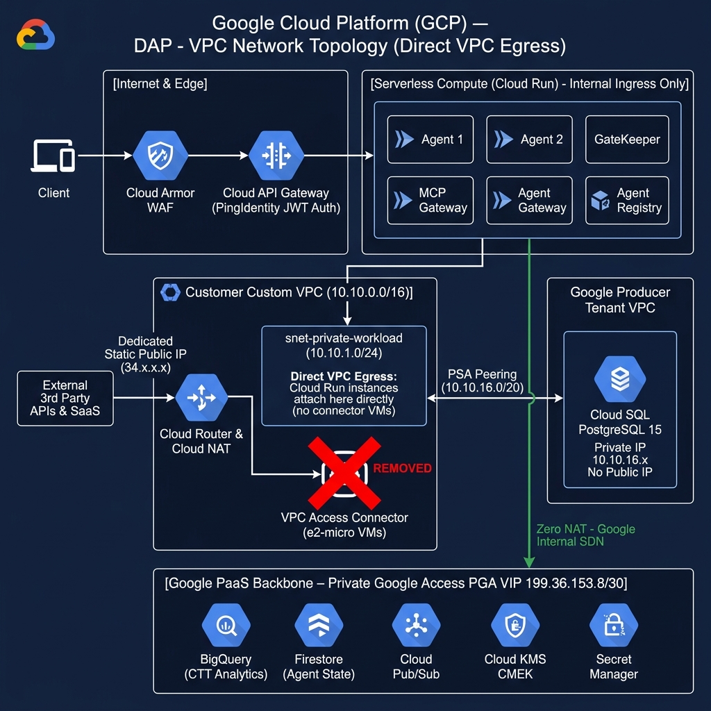
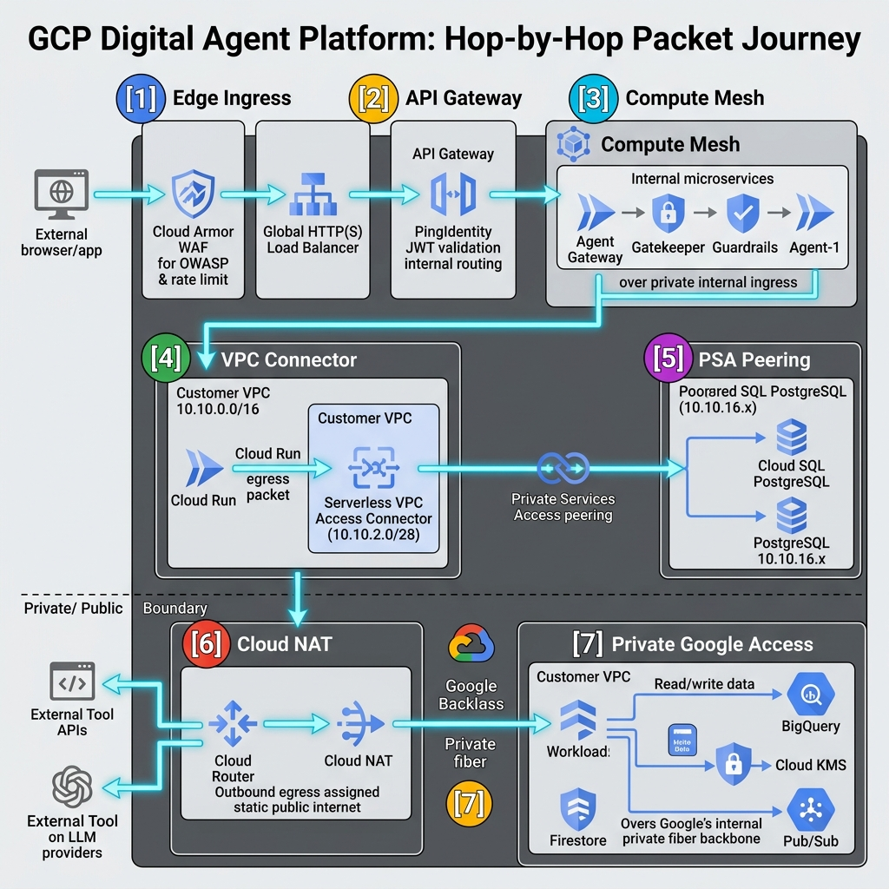
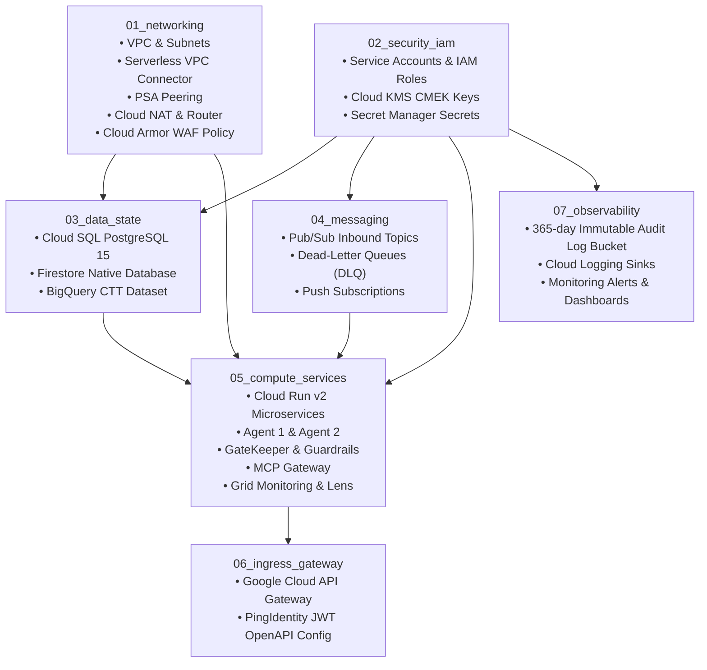

# Enterprise Digital Agent Platform (DAP) - GCP Architecture Guide

## 1. Executive Summary

The **Digital Agent Platform (DAP)** is a production-grade, event-driven, multi-agent AI execution platform provisioned on **Google Cloud Platform (GCP)**. It decouples client ingestion, security guardrails, agent reasoning, tool execution, and observability into isolated, serverless microservices with zero public ingress and hardened network boundaries.

```text
                                      GOOGLE CLOUD DAP (Data & Agent Platform)
+-------------------------------------------------------------------------------------------------------------------------+
|                                                                                                                         |
|  +--------------------+   +------------------------------------------------------------------------------------------+  |
|  | SHARED FOUNDATION  |   | [1] GOVERNANCE & STATE (03_data_state)                                                   |  |
|  | (02_security_iam)  |   |     - Guardrails (Safety & Content Filter)  <-------> PingIdentity (OAuth2 / OIDC)       |  |
|  | - Cloud IAM        |   |     - Firestore (Conversational / Agent State)                                           |  |
|  | - Secret Manager   |   |     - Audit Logs (Cloud Logging 365-day Bucket) (07_observability)                       |  |
|  | - KMS (CMEK)       |   +------------------------------------------------------------------------------------------+  |
|  | - Cloud Logging    |   | [2] AGENT REGISTRY                 | [3] AGENT WORKSPACE (Project)                       |  |
|  | - Cloud Monitoring |   |     - Agent Registry Service       |     - Agent 1  <==>  Agent 1 Inbound Topic (Pub/Sub) |  |
|  |                    |   |     - Agent Registry (Cloud SQL)   |     - Agent 2  <==>  Agent 2 Inbound Topic (Pub/Sub) |  |
|  |                    |   +------------------------------------+-----------------------------------------------------+  |
|  |                    |   | [4] AGENT BACKBONE & ORCHESTRATION (05_compute_services & 04_messaging)                  |  |
|  |                    |   |     - GateKeeper & GateKeeper Topic (Pub/Sub)  ==> CTT BigQuery (Analytics/Tracing)      |  |
|  |                    |   |     - MCP Gateway (Model Context Protocol)     ==> External Enterprise APIs              |  |
|  |                    |   |     - Agent Gateway & Topic (Cloud SQL / SOAM) ==> Routes to Agents & API Gateway        |  |
|  |                    |   |     - Grid Monitoring & Grid Lens (Observability & Dashboard UI)                         |  |
|  +--------------------+   +------------------------------------------------------------------------------------------+  |
+-------------------------------------------------------------------------------------------------------------------------+
                                              ^                                           |
                                              | Ingress via API Gateway                   | Egress Calls
                                              | (Cloud Armor WAF)                         v
                         +-----------------------------------+               +--------------------------+
                         | CLIENTS & CONSUMERS               |               | ENTERPRISE SERVICES      |
                         | - Internal Users & Admins         |               | - PingIdentity (IdP)     |
                         | - Business Application / BFF REST |               | - External Core APIs     |
                         |                                   |               | - LLM APIs (Vertex AI)   |
                         +-----------------------------------+               +--------------------------+
```

---

## 2. GCP VPC Network Topology & Traffic Flows



### Key Network Boundaries:
1. **Customer Custom VPC (`10.10.0.0/16`)**:
   - `snet-vpc-connector` (`10.10.2.0/28`): Micro-VM bridge connecting serverless Cloud Run into the VPC.
   - `snet-private-workload` (`10.10.1.0/24`): Subnet with **Private Google Access (PGA)** enabled.
   - **Cloud Router & Cloud NAT**: Handles static outbound internet egress for external MCP tool APIs.
   - **Reserved PSA Peering Range** (`10.10.16.0/20`): Connects to Google's Service Producer Tenant VPC.
2. **Google Service Producer Tenant VPC**:
   - Hosts **Cloud SQL (PostgreSQL 15)** instances with private IP addressing (`10.10.16.x`) peered via **Private Services Access (PSA)**.
3. **Google PaaS & Global APIs (Internal Backbone)**:
   - BigQuery, Firestore, Cloud KMS, Secret Manager, and Cloud Pub/Sub accessed privately over Google's internal software-defined network via **Private Google Access (PGA)** (Zero NAT).

---

## 3. Hop-by-Hop Packet & Connection Lifecycle



```text
[Client] 
   │ (Hop 1: TLS / HTTPS)
   ▼
[Cloud Armor WAF] ──(DDoS & OWASP Check)──► [Cloud API Gateway]
                                                │ (Hop 2: Internal Ingress + JWT Auth)
                                                ▼
                                      [Cloud Run: agent-gateway]
                                                │
                                                ├──(Hop 3: East-West Internal API Call)──► [gatekeeper] ──► [guardrails]
                                                │
                                                ├──(Hop 4: Serverless VPC Connector)──► [Customer VPC 10.10.0.0/16]
                                                │                                            │
                                                │                                            ├──(Hop 5: PSA Peering)──► [Cloud SQL PostgreSQL]
                                                │                                            │
                                                │                                            └──(Hop 6: Cloud NAT)──► [External MCP Tool APIs]
                                                │
                                                └──(Hop 7: Private Google Access / PGA)──► [BigQuery / Firestore / PubSub / KMS]
```

### Detailed Hop Breakdown:

#### 📍 Hop 1: Edge Ingress & WAF Inspection (Client ➔ Cloud Armor)
* **What happens**: The client request arrives at Google's global edge Anycast IP.
* **Security Inspection**: **Cloud Armor** inspects the HTTP headers and payload against OWASP ModSecurity Core Rule Sets (SQLi, XSS, RCE) and enforces rate limiting rules (max 500 req/min).
* **Action**: Malicious or rate-exceeded requests are blocked with `403 Forbidden` / `429 Too Many Requests` at Google's edge before reaching downstream compute.

#### 📍 Hop 2: Authentication & Gateway Routing (Cloud Armor ➔ Cloud API Gateway ➔ Agent Gateway)
* **What happens**: Clean requests pass from Cloud Armor to **Cloud API Gateway**.
* **Auth Verification**: The API Gateway intercepts the `Authorization: Bearer <JWT>` header and validates cryptographic signature, expiration, and issuer against **PingIdentity's JWKS** endpoint.
* **Routing**: The API Gateway uses its service account (`sa-dev-api-gateway`) with `roles/run.invoker` to mint a Google OIDC identity token and forward the request to the `agent-gateway` Cloud Run service over Google's secure internal proxy network.

#### 📍 Hop 3: East-West Microservice Orchestration (Cloud Run Inter-Service Communication)
* **What happens**: The `agent-gateway` routes tasks to `gatekeeper`, which calls `guardrails` for prompt safety analysis.
* **Security Boundary**: All internal Cloud Run microservices are configured with `ingress = "INGRESS_TRAFFIC_INTERNAL_ONLY"`. Direct public access from the internet is blocked; only authorized calls carrying Google IAM tokens are permitted.

#### 📍 Hop 4: Serverless-to-VPC Transition (Cloud Run ➔ VPC Access Connector)
* **What happens**: When microservices need to reach a private IP (`10.10.16.x`), Cloud Run evaluates its `vpc_access` policy (`egress = "PRIVATE_RANGES_ONLY"`).
* **The Bridge**: Cloud Run injects TCP packets into the dedicated **Serverless VPC Access Connector** instances in `snet-vpc-connector` (`10.10.2.0/28`), placing packets directly inside your Customer VPC.

#### 📍 Hop 5: VPC to Cloud SQL (Customer VPC ➔ PSA Peering ➔ Cloud SQL)
* **What happens**: Packets for PostgreSQL port `5432` leave the VPC Connector subnet and target the private IP of the database (`10.10.16.x`).
* **VPC Peering Transit**: Traffic traverses the **Private Services Access (PSA)** peering connection (`servicenetworking.googleapis.com`) into Google's Service Producer Tenant VPC.
* **Zero Public Exposure**: Cloud SQL has `ipv4_enabled = false` and cannot be reached from the internet.

#### 📍 Hop 6: Outbound Tool Egress (Cloud Run ➔ VPC ➔ Cloud NAT ➔ External APIs)
* **What happens**: When `agent-1` or `mcp-gateway` executes an external tool against third-party enterprise REST APIs or LLMs, the egress packet routes through the VPC Connector into the VPC.
* **NAT Translation**: The VPC's default route directs the packet through **Cloud Router** and **Cloud NAT**.
* **Static Egress**: Cloud NAT translates the private IP into a single, predictable **Static Public IP**, allowing enterprise firewalls to whitelist DAP egress traffic.

#### 📍 Hop 7: Private Google Access (Workload ➔ BigQuery / Firestore / KMS / Pub/Sub)
* **What happens**: Workloads stream telemetry to BigQuery, read/write state to Firestore, publish events to Pub/Sub, and fetch secrets from Secret Manager.
* **Private VIP Routing**: With `private_ip_google_access = true` on the subnetwork, DNS queries for `*.googleapis.com` resolve to Google Private VIPs (`199.36.153.8/30`).
* **Internal Backbone**: Traffic travels strictly over Google's internal software-defined network and **never traverses Cloud NAT or the public internet**.

---

## 4. Architecture Mapping to Terraform / Terragrunt Modules

The codebase is partitioned into 7 modular building blocks:



### Module Breakdown:

| Module | Code Location | Resources Provisioned | Security Controls |
| :--- | :--- | :--- | :--- |
| **01_networking** | `modules/01_networking/` | VPC, Subnets, VPC Access Connector, PSA Peering, Cloud Router, Cloud NAT, Cloud Armor | Edge DDoS/WAF protection, private RFC 1918 addressing |
| **02_security_iam** | `modules/02_security_iam/` | Dedicated SAs (`sa-agent-1`, `sa-gatekeeper`, etc.), Cloud KMS Keyrings/Keys, Secret Manager | Least-privilege IAM, envelope encryption with CMEK |
| **03_data_state** | `modules/03_data_state/` | Private Cloud SQL (Postgres 15), Firestore Native, BigQuery CTT Telemetry Dataset | Private IP only, KMS disk encryption, PGA transit |
| **04_messaging** | `modules/04_messaging/` | Pub/Sub Topics (`agent-1-inbound`, `gatekeeper-inbound`), Dead Letter Queues, IAM Push Subs | Message acknowledgement deadlines, DLQ retry policies |
| **05_compute_services** | `modules/05_compute_services/` | Cloud Run v2 services (`agent-1`, `agent-2`, `agent-gateway`, `gatekeeper`, `mcp-gateway`, `guardrails`, `grid-monitoring`, `grid-lens`) | `INGRESS_TRAFFIC_INTERNAL_ONLY`, VPC connector attachment |
| **06_ingress_gateway** | `modules/06_ingress_gateway/` | Google Cloud API Gateway, API Config, OpenAPI Specs with PingIdentity JWT security definitions | OAuth2/OIDC JWT validation, rate limiting |
| **07_observability** | `modules/07_observability/` | Cloud Storage Audit Bucket (365-day retention, Object Lock), Cloud Logging Sink, Alert Policies | Immutable compliance audit trails, operational metrics |

---

## 5. End-to-End Execution Flow (Interview Talking Points)

```text
[Client Request]
       │
       ▼
1. Cloud Armor WAF (Rate Limiting & OWASP Rules)
       │
       ▼
2. API Gateway (Validates PingIdentity JWT Token)
       │
       ▼
3. Agent Gateway (Cloud Run)
       │
       ├──► Publishes to GateKeeper Topic (Pub/Sub)
       │         │
       │         ▼
       │    4. GateKeeper (Cloud Run)
       │         │
       │         ├──► Validates Safety with Guardrails
       │         ▼
       │    5. Pushes to Agent Inbound Topic (Pub/Sub)
       │
       ▼
6. Agent 1 (Cloud Run Reasoning Engine)
       │
       ├──► Loads conversation memory from Firestore (via PGA)
       ├──► Queries Agent Registry DB (Cloud SQL via PSA Peering)
       ├──► Executes external tool via MCP Gateway (via Cloud NAT)
       └──► Streams token telemetry to BigQuery (via PGA)
       │
       ▼
7. Response routed back to Client via Agent Gateway & API Gateway
```

1. **Request Ingestion**:
   * A client sends a request to the **API Gateway** through **Cloud Armor WAF**.
   * The API Gateway verifies the JWT against **PingIdentity's JWKS** endpoint and routes the request to **Agent Gateway**.

2. **Security Inspection**:
   * The **Agent Gateway** publishes the task to **GateKeeper Topic**.
   * **GateKeeper** validates payload safety with **Guardrails** and pushes clean tasks to the **Agent Inbound Topic**.

3. **Agent Reasoning & Execution**:
   * **Agent 1** pulls the message, loads conversation context from **Firestore**, and prompts the **LLM API (Vertex AI)**.
   * If a tool is required, Agent 1 calls **MCP Gateway**, which executes the tool against the **External API** using credentials from **Secret Manager**.

4. **Multi-Agent Collaboration**:
   * Agent 1 queries the **Agent Registry** to resolve **Agent 2**, and delegates subtasks via the Agent Gateway.

5. **Telemetry & Audit**:
   * Step latency and token consumption are pushed to **Grid Monitoring** and archived in **CTT BigQuery**.
   * Admins inspect live telemetry and request flows in **Grid Lens**.
