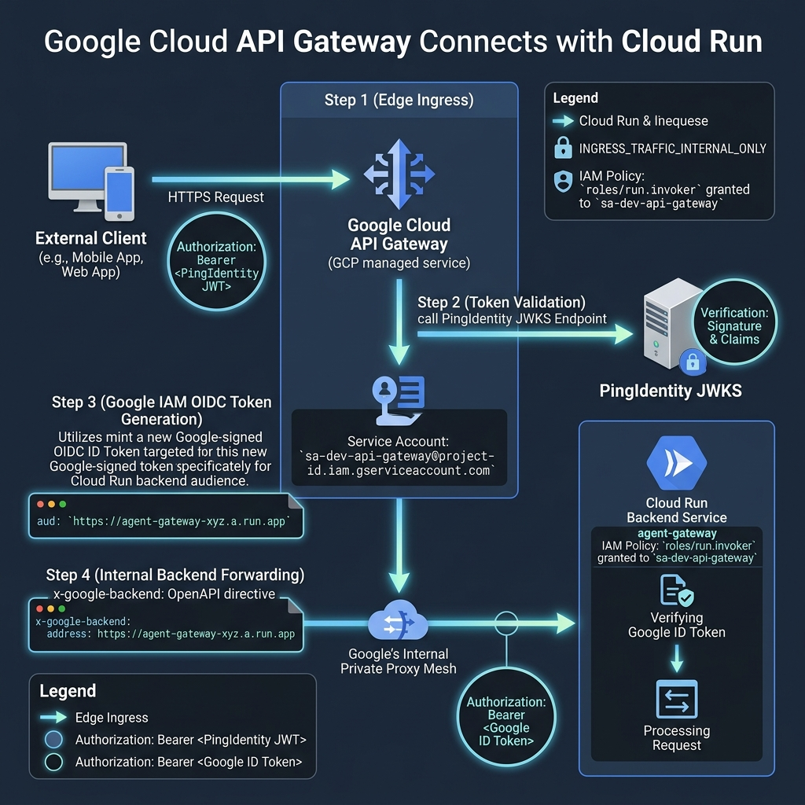
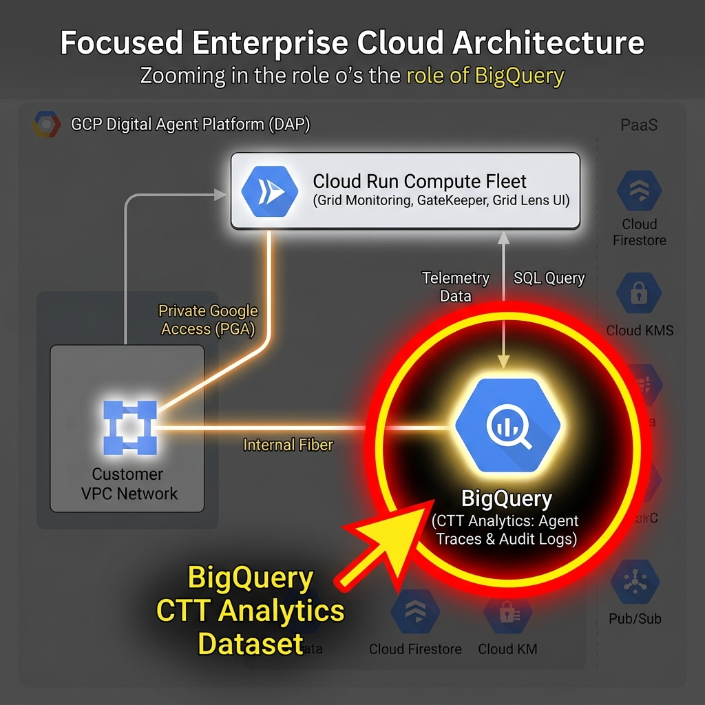

# Enterprise Digital Agent Platform (DAP) - Architecture Guide

## 1. Executive Summary

The **Digital Agent Platform (DAP)** is a cloud-native, event-driven, multi-agent AI execution platform hosted on **Google Cloud Platform (GCP)**. It decouples client requests, agent reasoning, tool execution, and security governance into dedicated, serverless microservices.

```
                                      GOOGLE CLOUD DAP (Data & Agent Platform)
+-------------------------------------------------------------------------------------------------------------------------+
|                                                                                                                         |
|  +--------------------+   +------------------------------------------------------------------------------------------+  |
|  | SHARED FOUNDATION  |   | [1] GOVERNANCE & STATE                                                                   |  |
|  | - Cloud IAM        |   |     - Guardrails (Safety & Content Filter)  <-------> PingIdentity (OAuth2 / OIDC)       |  |
|  | - Secret Manager   |   |     - Firestore (Conversational / Agent State)                                           |  |
|  | - KMS (CMEK)       |   |     - Audit Logs (Cloud Logging 365-day Bucket)                                          |  |
|  | - Cloud Logging    |   +------------------------------------------------------------------------------------------+  |
|  | - Cloud Monitoring |   | [2] AGENT REGISTRY                 | [3] AGENT WORKSPACE (Project)                       |  |
|  |                    |   |     - Agent Registry Service       |     - Agent 1  <==>  Agent 1 Inbound Topic (Pub/Sub) |  |
|  |                    |   |     - Agent Registry (Cloud SQL)   |     - Agent 2  <==>  Agent 2 Inbound Topic (Pub/Sub) |  |
|  |                    |   +------------------------------------+-----------------------------------------------------+  |
|  |                    |   | [4] AGENT BACKBONE & ORCHESTRATION                                                       |  |
|  |                    |   |     - GateKeeper & GateKeeper Topic (Pub/Sub)  ==> CTT BigQuery (Analytics/Tracing)      |  |
|  |                    |   |     - MCP Gateway (Model Context Protocol)     ==> External Enterprise APIs              |  |
|  |                    |   |     - Agent Gateway & Topic (Cloud SQL / SOAM) ==> Routes to Agents & API Gateway        |  |
|  |                    |   |     - Grid Monitoring & Grid Lens (Observability & Dashboard UI)                         |  |
|  +--------------------+   +------------------------------------------------------------------------------------------+  |
+-------------------------------------------------------------------------------------------------------------------------+
                                              ^                                           |
                                              | Ingress via API Gateway                   | Egress Calls
                                              | (Cloud Armor WAF)                         v
                         +-----------------------------------+               +--------------------------+
                         | CLIENTS & CONSUMERS               |               | ENTERPRISE SERVICES      |
                         | - Internal Users & Admins         |               | - PingIdentity (IdP)     |
                         | - Business Application / BFF REST |               | - External Core APIs     |
                         |                                   |               | - LLM APIs (Vertex AI)   |
                         +-----------------------------------+               +--------------------------+
```

---

## 2. GCP VPC Network Topology & Traffic Flows


### Key Network Boundaries:
1. **Customer Custom VPC (`10.10.0.0/16`)**:
   - `snet-vpc-connector` (`10.10.2.0/28`): Micro-VM bridge connecting serverless Cloud Run into the VPC.
   - `snet-private-workload` (`10.10.1.0/24`): Subnet with **Private Google Access (PGA)** enabled.
   - **Cloud Router & Cloud NAT**: Handles static outbound internet egress for external MCP tool APIs.
   - **Reserved PSA Peering Range** (`10.10.16.0/20`): Connects to Google's Service Producer Tenant VPC.
2. **Google Service Producer Tenant VPC**:
   - Hosts **Cloud SQL (PostgreSQL 15)** instances with private IP addressing (`10.10.16.x`) peered via **Private Services Access (PSA)**.
3. **Google PaaS & Global APIs (Internal Backbone)**:
   - Firestore, BigQuery, KMS, Secret Manager, and Cloud Pub/Sub accessed privately over Google's internal software-defined network via **Private Google Access (PGA)**.

---

### 🚀 Hop-by-Hop Packet & Connection Lifecycle


```
[Client] 
   │ (Hop 1: TLS / HTTPS)
   ▼
[Cloud Armor WAF] ──(DDoS & OWASP Check)──► [Cloud API Gateway]
                                                    │ (Hop 2: Internal Ingress + JWT Auth)
                                                    ▼
                                          [Cloud Run: agent-gateway]
                                                    │
                                                    ├──(Hop 3: East-West Internal API Call)──► [gatekeeper] ──► [guardrails]
                                                    │
                                                    ├──(Hop 4: Serverless VPC Connector)──► [Customer VPC 10.10.0.0/16]
                                                    │                                            │
                                                    │                                            ├──(Hop 5: PSA Peering)──► [Cloud SQL PostgreSQL]
                                                    │                                            │
                                                    │                                            └──(Hop 6: Cloud NAT)──► [External MCP Tool APIs]
                                                    │
                                                    └──(Hop 7: Private Google Access / PGA)──► [Firestore / BigQuery / PubSub / KMS]
```

#### 📍 Hop 1: Edge Ingress & WAF Inspection (Client ➔ Cloud Armor)
* **What happens**: The client request arrives at Google's global edge Anycast IP.
* **Security Inspection**: **Cloud Armor** inspects the HTTP headers and payload against OWASP ModSecurity Core Rule Sets (SQLi, XSS, RCE) and verifies that the request complies with rate limiting rules (max 500 req/min).
* **Action**: Malicious or rate-exceeded requests are dropped with `403 Forbidden` / `429 Too Many Requests` at Google's edge before consuming any compute resources.

#### 📍 Hop 2: Authentication & Gateway Routing (Cloud Armor ➔ Cloud API Gateway ➔ Agent Gateway)
* **What happens**: Clean requests pass from Cloud Armor to **Cloud API Gateway**.
* **Auth Verification**: The API Gateway intercepts the `Authorization: Bearer <JWT>` header and validates the cryptographic signature, expiration, and issuer against **PingIdentity's JWKS** endpoint.
* **Routing**: Once authorized, the API Gateway forwards the request to the `agent-gateway` Cloud Run service over Google's secure internal proxy network.

#### 📍 Hop 3: East-West Microservice Orchestration (Cloud Run Inter-Service Communication)
* **What happens**: The `agent-gateway` routes tasks to `gatekeeper`, which calls `guardrails` for prompt safety analysis.
* **Security Boundary**: All internal Cloud Run microservices are configured with `ingress = "INGRESS_TRAFFIC_INTERNAL_ONLY"`. Direct public access from the internet is completely blocked; only authorized calls from the API Gateway and fellow microservices carrying Google IAM tokens are permitted.

#### 📍 Hop 4: Serverless-to-VPC Transition (Cloud Run ➔ VPC Access Connector)
* **What happens**: When microservices (e.g. `agent-registry` or `agent-gateway`) need to connect to a private IP (e.g. `10.10.16.x`), Cloud Run evaluates its `vpc_access` policy (`egress = "PRIVATE_RANGES_ONLY"`).
* **The Bridge**: Instead of attempting to route over the public internet, Cloud Run injects the TCP packets into the dedicated **Serverless VPC Access Connector** instances residing in `snet-vpc-connector` (`10.10.2.0/28`). The packets are now natively inside your Customer VPC.

#### 📍 Hop 5: VPC to Cloud SQL (Customer VPC ➔ Private Services Access Peering ➔ Cloud SQL)
* **What happens**: The packets for PostgreSQL port `5432` leave the VPC Connector subnet and target the private IP of the database (`10.10.16.x`).
* **VPC Peering Transit**: The route crosses the **Private Services Access (PSA)** peering connection (`servicenetworking.googleapis.com`) directly into Google's hidden Service Producer Tenant VPC.
* **Zero Public Exposure**: The Cloud SQL instance has `ipv4_enabled = false` and cannot be reached from the public internet.

#### 📍 Hop 6: Outbound Tool Egress (Cloud Run ➔ VPC ➔ Cloud NAT ➔ External APIs)
* **What happens**: When `agent-1` or `mcp-gateway` executes an external tool against third-party enterprise REST APIs or LLMs, the egress packet routes through the VPC Connector into the VPC.
* **NAT Translation**: The VPC's default route directs the packet through **Cloud Router** and **Cloud NAT**.
* **Static Egress**: Cloud NAT translates the private IP into a single, predictable **Static Public IP**, allowing enterprise firewalls to whitelist DAP egress traffic.

#### 📍 Hop 7: Private Google Access (Workload ➔ Firestore / BigQuery / KMS / Pub/Sub)
* **What happens**: Workloads constantly read/write conversational state to Firestore, publish events to Pub/Sub, stream telemetry to BigQuery, and fetch secrets from Secret Manager.
* **Private VIP Routing**: Because `private_ip_google_access = true` is enabled on the subnetwork, DNS queries for `*.googleapis.com` resolve to Google Private VIPs (`199.36.153.8/30`).
* **Internal Backbone**: The packets travel strictly over Google's internal software-defined network and never touch the public internet.

---

## 4. Module by Module Deep-Dive

### Module 1: Ingress & Perimeter Defense



* **Cloud Armor (INT WAF)**: Protects edge entrypoints with rate limiting, OWASP ModSecurity rule sets (SQLi, XSS, RCE), and IP filtering.
* **API Gateway**: Provides managed REST endpoints, rate limiting, and validates incoming JWT tokens issued by **PingIdentity**.
* **PingIdentity Integration**: Enterprise OIDC authority validating user authentication and authorization scopes.
* **API Gateway ➔ Cloud Run Bridge**: API Gateway uses its dedicated service account (`sa-dev-api-gateway`) with `roles/run.invoker` to mint a Google-signed OIDC ID token for the Cloud Run backend audience (`x-google-backend`), allowing it to securely invoke `INGRESS_TRAFFIC_INTERNAL_ONLY` Cloud Run services over Google's internal private proxy mesh.

### Module 2: Agent Registry Tier
* **Agent Registry (Cloud Run)**: Catalog service for discovering registered agents, versions, schemas, and allowed tools.
* **Agent Registry DB (Cloud SQL Postgres)**: Private IP relational store for catalog metadata.

### Module 3: Agent Execution Workspace
* **Agent 1 & Agent 2 (Cloud Run)**: Containerized agent reasoning runtimes.
* **Inbound Topics (Pub/Sub)**: Dedicated message queues for asynchronous task ingestion, retries, and workload smoothing.

### Module 4: Agent Backbone & Orchestration Core
* **Agent Gateway (Cloud Run + Cloud SQL)**: Central orchestration bus implementing **SOAM** (*Service Oriented Agent Messaging*).
* **GateKeeper & GateKeeper Topic (Pub/Sub + Cloud Run)**: Security enforcement proxy. Inspects prompts for prompt injection, sensitive PII leakage (DLP), and validates PingIdentity scopes.
* **MCP Gateway (Model Context Protocol)**: Secure tool execution proxy connecting Agents to **External APIs** without exposing raw credentials.
* **Grid Monitoring & Grid Lens**: Real-time OpenTelemetry trace collector and operational dashboard UI.

### Module 5: Governance & State



* **Guardrails**: Pre-execution and post-execution content moderation and safety policy engine.
* **Firestore (`Agent State`)**: Low-latency NoSQL document store for conversational memory and checkpoints.
* **CTT BigQuery**: Continuous Telemetry & Tracing data warehouse for token cost analytics, latency tracking, and audit trails.

### Module 6: Shared Foundation Security
* **Cloud IAM**: Least-privilege dedicated service accounts for every microservice.
* **Cloud KMS (CMEK)**: Customer-managed encryption keys for data at rest.
* **Secret Manager**: Secure vault for credentials, passwords, and external API keys.

---

## 3. End-to-End Workflow (Interview Talking Points)

1. **Request Ingestion**:
   * A client sends a request to the **API Gateway** through **Cloud Armor WAF**.
   * The API Gateway verifies the JWT against **PingIdentity's JWKS** endpoint and routes the request to **Agent Gateway**.

2. **Security Inspection**:
   * The **Agent Gateway** publishes the task to **GateKeeper Topic**.
   * **GateKeeper** validates payload safety with **Guardrails** and pushes clean tasks to the **Agent Inbound Topic**.

3. **Agent Reasoning & Execution**:
   * **Agent 1** pulls the message, loads conversation context from **Firestore**, and prompts the **LLM API (Vertex AI)**.
   * If a tool is required, Agent 1 calls **MCP Gateway**, which executes the tool against the **External API** using credentials from **Secret Manager**.

4. **Multi-Agent Collaboration**:
   * Agent 1 queries the **Agent Registry** to resolve **Agent 2**, and delegates subtasks via the Agent Gateway.

5. **Telemetry & Audit**:
   * Step latency and token consumption are pushed to **Grid Monitoring** and archived in **CTT BigQuery**.
   * Admins inspect live graphs in **Grid Lens**.
