# Deployment & Operational Runbook: DAP Infrastructure on GCP via Terragrunt

This runbook is the comprehensive, step-by-step operational guide for provisioning, operating, and troubleshooting the **Digital Agent Platform (DAP)** using **Terragrunt**, **Terraform modules**, and **GitHub Actions** with **Keyless Workload Identity Federation (WIF)**.

---

## 🎨 Architecture & CI/CD Flow


---

## 📋 Prerequisites & Tooling Setup

Ensure the following tools are installed and configured on your machine:

| Tool | Minimum Version | Installation / Verification |
| :--- | :--- | :--- |
| **Terraform** | `1.7.0+` | `terraform version` |
| **Terragrunt** | `1.1.0+` | `terragrunt --version` |
| **Google Cloud SDK (`gcloud`)** | `460.0.0+` | `gcloud version` |
| **Git** | `2.30.0+` | `git version` |

### Initial GCP Authentication
Authenticate your local shell for both Google Cloud CLI commands and Terraform Application Default Credentials (ADC):

```bash
# Authenticate gcloud CLI
gcloud auth login

# Set your active GCP project
gcloud config set project YOUR_GCP_PROJECT_ID

# Authenticate Terraform ADC for local Terragrunt runs
gcloud auth application-default login
```

---

## 🚀 Step 1: One-Time Bootstrap (WIF & Remote State Buckets)

The `gcp/bootstrap` directory contains a standalone Terraform root module that provisions the foundational resources required by CI/CD and Terragrunt before any application infrastructure is deployed:

* **Remote State GCS Buckets**: Versioned, encrypted buckets (`${project_id}-tfstate-dev`, `${project_id}-tfstate-staging`, `${project_id}-tfstate-prod`).
* **CI/CD Service Account**: `sa-dap-tf-provisioner@<project_id>.iam.gserviceaccount.com` with least-privilege administrative IAM roles.
* **Workload Identity Pool & Provider**: OIDC integration with GitHub Actions (`token.actions.githubusercontent.com`) enabling keyless authentication.

### Provision Bootstrap

```bash
cd gcp/bootstrap

# 1. Initialize Terraform
terraform init

# 2. Plan and Apply Bootstrap
terraform apply \
  -var="project_id=YOUR_GCP_PROJECT_ID" \
  -var="region=europe-west1" \
  -var="github_org_or_user=YOUR_GITHUB_ORG_OR_USER" \
  -var="github_repository=YOUR_GITHUB_ORG_OR_USER/YOUR_REPO_NAME"
```

### Note the Bootstrap Outputs:
Upon completion, save the outputs printed in your terminal:
```text
Outputs:
gcs_state_bucket_names = {
  "dev"     = "YOUR_GCP_PROJECT_ID-tfstate-dev"
  "staging" = "YOUR_GCP_PROJECT_ID-tfstate-staging"
  "prod"    = "YOUR_GCP_PROJECT_ID-tfstate-prod"
}
terraform_service_account_email = "sa-dap-tf-provisioner@YOUR_GCP_PROJECT_ID.iam.gserviceaccount.com"
workload_identity_provider_name = "projects/123456789/locations/global/workloadIdentityPools/github-actions-pool/providers/github-actions-provider"
```

---

## 🔐 Step 2: Configure GitHub Actions Secrets

In your GitHub repository:
1. Navigate to **Settings** > **Secrets and variables** > **Actions**.
2. Click **New repository secret** and configure:

| Secret Name | Source Value from Bootstrap Output | Description |
| :--- | :--- | :--- |
| `GCP_WIF_PROVIDER` | `workload_identity_provider_name` | Full resource path of the WIF pool provider |
| `GCP_TF_SA_EMAIL` | `terraform_service_account_email` | Service account email that GitHub Actions impersonates |

> [!NOTE]
> No JSON service account keys are stored or needed. Authentication uses short-lived OIDC tokens exchanged at runtime.

---

## ⚙️ Step 3: Configure Environment Variables (`env.hcl`)

Update `gcp/live/<env>/env.hcl` for each environment (`dev`, `staging`, `prod`) to set project IDs, network CIDRs, and database sizing.

### Example: `gcp/live/dev/env.hcl`
```hcl
locals {
  environment = "dev"
  project_id  = "YOUR_GCP_DEV_PROJECT_ID"
  region      = "europe-west1"

  # Networking — Direct VPC Egress uses snet-private-workload directly (no VPC Access Connector)
  subnet_cidr = "10.10.1.0/24"

  # Cloud SQL Compute Tier
  db_tier = "db-custom-2-7680"

  # Cloud Run Container Image Tags
  image_tags = {
    agent_1         = "latest"
    agent_2         = "latest"
    agent_gateway   = "latest"
    gatekeeper      = "latest"
    mcp_gateway     = "latest"
    guardrails      = "latest"
    grid_monitoring = "latest"
    grid_lens       = "latest"
  }
}
```

---

## 💻 Step 4: Local Deployment Workflow with Terragrunt

Terragrunt automatically manages remote state backend generation, provider blocks, and the 7-module dependency Directed Acyclic Graph (DAG).

```text
Dependency Execution Hierarchy:
01_networking ──┬──► 03_data_state ──┐
02_security_iam ─┤                   ├──► 05_compute_services ──► 06_ingress_gateway
                └──► 04_messaging ──┘
02_security_iam ───► 07_observability
```

### 1. Inspect Dependency Graph
```bash
cd gcp/live/dev

# Visualize the module DAG
terragrunt dag graph
```

### 2. Full Environment Plan
Run a plan across all 7 modules in strict topological dependency order:
```bash
cd gcp/live/dev
terragrunt run --all plan
```

### 3. Full Environment Apply
Deploy the complete 7-module platform:
```bash
cd gcp/live/dev
terragrunt run --all apply --non-interactive
```

### 4. Deploy or Iterate on a Single Module
When working on a specific layer, navigate directly to that unit:
```bash
# Example: Apply changes only to compute services
cd gcp/live/dev/05_compute_services
terragrunt plan
terragrunt apply
```

### 5. Tear Down / Destroy Environment
To safely destroy all resources in reverse topological dependency order:
```bash
cd gcp/live/dev
terragrunt run --all destroy --non-interactive
```

---

## 🤖 Step 5: Automated CI/CD GitOps via GitHub Actions

The pipeline at `.github/workflows/terragrunt-gcp.yml` automates deployment across environments based on Git events:

```mermaid
flowchart LR
    A["Branch: feat/*"] -->|"PR to develop"| B["terragrunt plan (dev)"]
    B -->|"Merge to develop"| C["terragrunt apply (dev)"]
    C -->|"PR to staging"| D["terragrunt plan (staging)"]
    D -->|"Merge to staging"| E["terragrunt apply (staging)"]
    E -->|"PR to main"| F["terragrunt plan (prod)"]
    F -->|"Merge to main + Approval"| G["terragrunt apply (prod)"]
```



### GitOps Workflow Rules:
1. **Develop / Dev**:
   * Create feature branch: `git checkout -b feature/my-feature`
   * Open PR against `develop` ➔ GitHub Actions runs `terragrunt plan` for **`dev`**.
   * Merge PR to `develop` ➔ GitHub Actions runs `terragrunt apply` to deploy to **`dev`**.
2. **Staging**:
   * Open PR from `develop` against `staging` ➔ GitHub Actions runs `terragrunt plan` for **`staging`**.
   * Merge PR to `staging` ➔ GitHub Actions runs `terragrunt apply` to deploy to **`staging`**.
3. **Production**:
   * Open PR from `staging` against `main` ➔ GitHub Actions runs `terragrunt plan` for **`prod`**.
   * Merge PR to `main` ➔ **Manual Reviewer Approval Gate** triggers in GitHub Actions.
   * Upon sign-off, GitHub Actions runs `terragrunt apply` to deploy to **`prod`**.
4. **Manual Dispatch**:
   * Go to **Actions** tab > **GCP DAP Terragrunt Multi-Env CI/CD** > **Run workflow**.
   * Select environment (`dev`, `staging`, `prod`) and action (`plan`, `apply`, `destroy`).

---

## 🔍 Step 6: Post-Deployment Smoke Tests & Verification

Run these verification commands after deployment:

```bash
PROJECT_ID="YOUR_GCP_PROJECT_ID"
REGION="europe-west1"

# 1. Verify Cloud Run Microservices (9 services)
gcloud run services list --project="${PROJECT_ID}" --region="${REGION}"

# 2. Verify Direct VPC Egress configuration on Cloud Run
gcloud run services describe dev-agent-gateway \
  --project="${PROJECT_ID}" \
  --region="${REGION}" \
  --format="yaml(spec.template.spec.containers[0].resources,spec.template.metadata.annotations)"

# 3. Verify Cloud SQL Private IP Instances (Registry + SOAM Gateway)
gcloud sql instances list --project="${PROJECT_ID}"

# 4. Verify Pub/Sub SOAM Topics and DLQ
gcloud pubsub topics list --project="${PROJECT_ID}"
gcloud pubsub subscriptions list --project="${PROJECT_ID}"

# 5. Verify BigQuery CTT Dataset and Tables
bq ls --project_id="${PROJECT_ID}"
bq ls "${PROJECT_ID}:dap_ctt_telemetry_dev"

# 6. Verify Cloud API Gateway Status
gcloud api-gateway gateways list --project="${PROJECT_ID}" --location="${REGION}"

# 7. Verify Cloud NAT Static Egress IP
gcloud compute routers nats list --router=dev-dap-router --region="${REGION}" --project="${PROJECT_ID}"
```

---

## 🛠️ Step 7: Troubleshooting & Common Fixes

### 1. `Error 404: The specified bucket does not exist`
* **Root Cause**: Terragrunt is attempting to initialize remote state in a bucket that hasn't been created yet.
* **Resolution**:
  1. Run the bootstrap step first:
     ```bash
     cd gcp/bootstrap && terraform apply
     ```
  2. Or manually create the missing bucket via `gcloud`:
     ```bash
     gcloud storage buckets create "gs://YOUR_PROJECT_ID-tfstate-dev" \
       --project="YOUR_PROJECT_ID" \
       --location="europe-west1" \
       --uniform-bucket-level-access
     ```

### 2. `Error: googleapi: Error 403: Caller does not have required permission`
* **Root Cause**: Your local gcloud identity or the Terraform CI/CD Service Account is missing one of the necessary IAM roles.
* **Resolution**: Verify that the SA has the roles listed in `gcp/bootstrap/main.tf` (`roles/compute.networkAdmin`, `roles/run.admin`, `roles/cloudsql.admin`, etc.).

### 3. `Error: Private Services Access (PSA) Peering already exists or overlaps`
* **Root Cause**: The PSA peering range (`10.10.16.0/20`) conflicts with an existing peering connection.
* **Resolution**: Ensure no other service is using `servicenetworking.googleapis.com` on the same subnet CIDR, or update `psa_peering_cidr` in `01_networking/variables.tf`.

### 4. Direct VPC Egress Subnet IP Exhaustion
* **Root Cause**: High Cloud Run concurrency or scale-out exhausts available IPs in `snet-private-workload`.
* **Resolution**: Ensure subnet sizes are sized appropriately:
  * `dev` / `staging`: `/24` (254 IPs)
  * `prod`: `/22` (1022 IPs) configured in `gcp/live/prod/env.hcl`.

### 5. Stale Terragrunt Cache
* **Root Cause**: Corrupted `.terragrunt-cache` or changed provider/module sources.
* **Resolution**: Clear all local cache folders:
  ```bash
  find gcp/live -type d -name ".terragrunt-cache" -prune -exec rm -rf {} +
  ```

---

## 📚 Related Documentation
* **[GCP DAP Architecture Guide](ARCHITECTURE.md)**: Deep dive into SOAM, Direct VPC Egress, Hop-by-Hop lifecycles, and security controls.
* **[Terragrunt Reference Guide](TERRAGRUNT.md)**: In-depth Terragrunt mechanics, DAG resolution, and configuration syntax.
