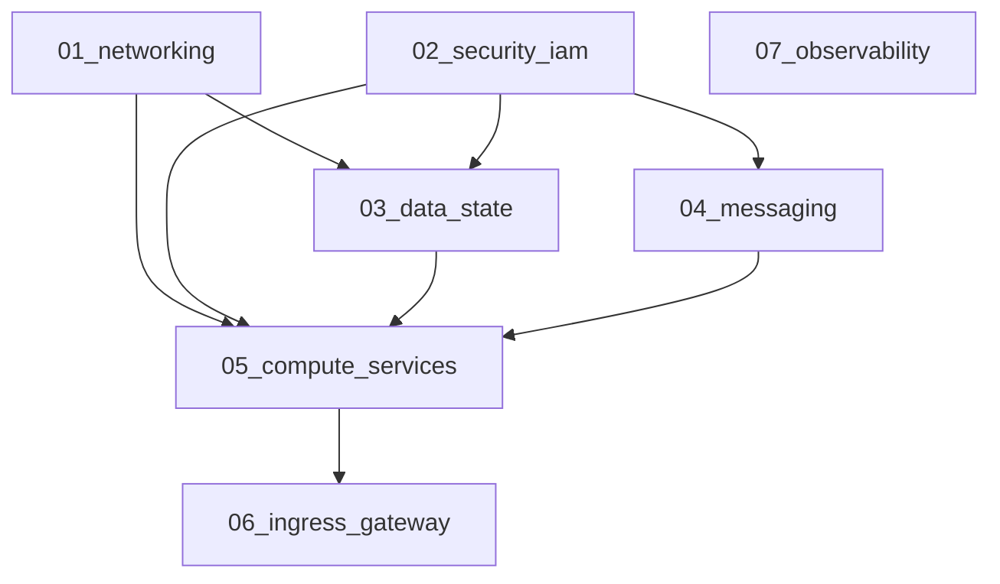

# Terragrunt Multi-Environment Guide: GCP Digital Agent Platform (DAP)

This guide details how **Terragrunt** orchestrates multi-environment GCP infrastructure (`dev`, `staging`, `prod`) with zero duplication, isolated state files, automated dependency orchestration, and GitHub Actions CI/CD integration.

---

## 🎨 Multi-Environment Architecture & CI/CD Diagram


---

## 1. Directory Structure

```text
cloud-run/
├── .github/
│   └── workflows/
│       └── terragrunt-gcp.yml        # Multi-environment CI/CD workflow (WIF Keyless Auth)
│
├── gcp/
│   ├── modules/                      # Reusable Terraform Modules (Source Code)
│   │   ├── 01_networking/
│   │   ├── 02_security_iam/
│   │   ├── 03_data_state/
│   │   ├── 04_messaging/
│   │   ├── 05_compute_services/
│   │   ├── 06_ingress_gateway/
│   │   └── 07_observability/
│   │
│   └── live/                         # Terragrunt Live Deployments
│       ├── root.hcl                  # 🌐 Global Root: GCS Remote State & Provider generation
│       │
│       ├── dev/                      # 🧪 Dev Environment (my-dap-gcp-dev)
│       │   ├── env.hcl
│       │   ├── 01_networking/terragrunt.hcl
│       │   ├── 02_security_iam/terragrunt.hcl
│       │   ├── 03_data_state/terragrunt.hcl
│       │   ├── 04_messaging/terragrunt.hcl
│       │   ├── 05_compute_services/terragrunt.hcl
│       │   ├── 06_ingress_gateway/terragrunt.hcl
│       │   └── 07_observability/terragrunt.hcl
│       │
│       ├── staging/                  # 🚀 Staging Environment (my-dap-gcp-staging)
│       │   ├── env.hcl
│       │   └── ... (01 through 07)
│       │
│       └── prod/                     # 🛡️ Production Environment (my-dap-gcp-prod)
│           ├── env.hcl
│           └── ... (01 through 07)
```

---

## 2. Dependency Graph (DAG)

Terragrunt automatically analyzes `dependency` blocks across modules:



---

## 3. Terragrunt CLI Commands

### A. Deploying / Planning an Entire Environment
From any environment directory (`dev`, `staging`, or `prod`):

```bash
cd gcp/live/dev

# 1. Validate all modules and dependency graph
terragrunt dag graph

# 2. Plan all modules in topological order
terragrunt run --all plan

# 3. Apply all modules across the DAG
terragrunt run --all apply
```

### B. Targeting a Single Module (Reduced Blast Radius)
If you only changed Cloud Run microservices:

```bash
cd gcp/live/dev/05_compute_services

# Runs only against the compute_services state file
terragrunt plan
terragrunt apply
```

### C. Teardown / Destroy
```bash
cd gcp/live/dev

# Safely tears down resources in reverse dependency order
terragrunt run --all destroy
```

---

## 4. GitHub Actions CI/CD Integration

The CI/CD pipeline at `.github/workflows/terragrunt-gcp.yml` automates the workflow:
* **Pull Request**: Runs parallel matrix plan across `[dev, staging, prod]`.
* **Merge to `develop`**: Runs `terragrunt run --all apply` against `gcp/live/dev`.
* **Merge to `main`**: Runs `terragrunt run --all apply` against `gcp/live/prod`.
* **Manual Dispatch**: Select environment (`dev`, `staging`, `prod`) and action (`plan`, `apply`, `destroy`).
