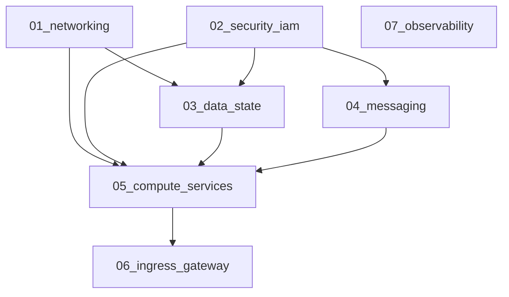

# Terragrunt Guide: GCP Digital Agent Platform (DAP)

This guide covers how **Terragrunt** is structured in this repository to manage multi-environment GCP infrastructure with zero duplication, isolated state files, and automated dependency orchestration.

---

## 1. Directory Structure

```text
cloud-run/
├── gcp/
│   ├── modules/                      # Reusable Terraform Modules (Source Code)
│   │   ├── 01_networking/
│   │   ├── 02_security_iam/
│   │   ├── 03_data_state/
│   │   ├── 04_messaging/
│   │   ├── 05_compute_services/
│   │   ├── 06_ingress_gateway/
│   │   └── 07_observability/
│   │
│   └── live/                         # Terragrunt Live Deployments
│       ├── root.hcl                  # Global Root: GCS Remote State & Provider generation
│       │
│       └── dev/                      # Development Environment
│           ├── env.hcl               # Environment variables (dev, region, CIDRs, DB tier)
│           ├── 01_networking/
│           │   └── terragrunt.hcl
│           ├── 02_security_iam/
│           │   └── terragrunt.hcl
│           ├── 03_data_state/
│           │   └── terragrunt.hcl    # Depends on 01_networking & 02_security_iam
│           ├── 04_messaging/
│           │   └── terragrunt.hcl    # Depends on 02_security_iam
│           ├── 05_compute_services/
│           │   └── terragrunt.hcl    # Depends on 01, 02, 03, 04
│           ├── 06_ingress_gateway/
│           │   └── terragrunt.hcl    # Depends on 05_compute_services
│           └── 07_observability/
│               └── terragrunt.hcl
```

---

## 2. Dependency Graph (DAG)

Terragrunt automatically analyzes `dependency` blocks to build the optimal execution graph:



---

## 3. Terragrunt CLI Commands

### A. Deploying / Planning the Entire Environment
From the `gcp/live/dev/` directory:

```bash
cd gcp/live/dev

# 1. Validate all modules and dependency graph
terragrunt dag graph

# 2. Plan all modules in topological order
terragrunt run --all plan

# 3. Apply all modules across the DAG
terragrunt run --all apply
```

### B. Targeting a Single Module (Reduced Blast Radius)
If you only changed Cloud Run services or want to iterate quickly:

```bash
cd gcp/live/dev/05_compute_services

# Runs only against the compute_services state file
terragrunt plan
terragrunt apply
```

### C. Teardown / Destroy
```bash
cd gcp/live/dev

# Safely tears down resources in reverse dependency order
terragrunt run --all destroy
```

---

## 4. How to Add a New Environment (e.g. `prod`)

To add a new production environment:
1. Create a new folder: `gcp/live/prod/`
2. Copy `gcp/live/dev/env.hcl` into `gcp/live/prod/env.hcl` and adjust settings:
   ```hcl
   locals {
     environment = "prod"
     project_id  = "prod-dap-gcp-project"
     region      = "europe-west1"
     db_tier     = "db-custom-8-32768"
   }
   ```
3. Copy the module folders (`01_networking/`, `02_security_iam/`, etc.) from `dev/` to `prod/`.
4. Run `terragrunt run --all apply` inside `gcp/live/prod/`.
